# A Comprehensive Analysis on California Housing Dataset 

## Project Overview

This project presents a comprehensive data science and deep learning analysis of the California Housing dataset. The primary objective is to predict median house values using a fully connected neural network implemented from scratch in PyTorch while systematically investigating how different data preparation techniques, loss functions, and optimization algorithms affect model performance.

The project begins with an extensive data analysis and preparation phase. This includes exploratory data analysis (EDA), feature distribution analysis, skewness reduction, outlier detection and mitigation, feature engineering, feature transformation, and data standardization. The goal of this stage is not only to prepare the data for training but also to better understand the characteristics and challenges of the dataset.

Beyond data preparation, the project investigates several important aspects of deep learning for tabular regression problems. Multiple regression loss functions are implemented and compared, including MSE, MAE, Huber, Log-Cosh, and several adaptive robust losses such as Welsch, Geman-McClure, Cauchy, and Charbonnier. In addition, different optimization algorithms, including SGD, SGD with Momentum, SGD with Nesterov Momentum, RMSprop, Adam, and AdamW, are evaluated and compared. For each experiment, both the loss value and the $R^2$ score are monitored and analyzed to assess convergence behavior, robustness to outliers, and overall predictive performance.

Special attention is given to the relationship between data characteristics and model behavior. The experiments analyze how skewed distributions, outliers, robust loss functions, and different optimization strategies influence training stability, convergence speed, and generalization performance.

This project was developed for educational and research purposes and serves as a practical exploration of data science, neural network regression, robust loss functions, and optimization techniques for real-world tabular datasets.


## Project Structure

```text
heart-failure-risk-prediction/
├─ assets/
│  ├─ PNG Files
├─ dataset/
│  ├─ data.zip
│  ├─ housing.csv
├─ notebooks/
│  ├─ 01_data_preparation.ipynb
│  ├─ 02_loss_functions.ipynb
│  ├─ 03_optimizers.ipynb
│  ├─ 04_test.ipynb
├─ saved_values/
│  ├─ data.pt
│  ├─ MSE_best_model.pth
│  ├─ MAE_best_model.pth
│  ├─ Huber_best_model.pth
│  ├─ Adaptive_Quadratic_best_model.pth
│  ├─ Adaptive_Cauchy_best_model.pth
│  ├─ Adaptive_Welsch_best_model.pth
│  ├─ Adaptive_Charbonnier_best_model.pth
│  ├─ Adaptive_Geman_McClure_best_model.pth
│  ├─ Log-Cosh_best_model.pth
│  ├─ AdamW_best_model.pth
│  ├─ SGD1e-3_best_model.pth
│  ├─ SGD_M_best_model.pth
│  ├─ SGD_N_best_model.pth
│  ├─ RMSprop_best_model.pth
│  ├─ Adam_best_model.pth
├─ src/
│  ├─ data_utils.py
│  ├─ training_utils.py
├─ .gitignore
├─ README.md
```

## File Descriptions

| File / Folder | Description |
|---|---|
| `assets/` | Images |
| `dataset/` | Dataset files used for training and testing |
| `notebooks/` | Notebooks containing the experiments and analyses for each project phase |
| `notebooks/01_data_preparation.ipynb` | Analyze various aspects of the data and prepare it for model training |
| `notebooks/02_loss_functions.ipynb` | Comparison of different loss functions and their impact on model performance |
| `notebooks/03_optimizers.ipynb` | Comparison of different optimizers and their impact on model performance |
| `notebooks/04_test.ipynb` | Testing the model trained with the best-performing loss function and optimizer |
| `saved_values/` | Model checkpoints and processed data |
| `src/` | Source files containing reusable classes and utility functions |
| `src/training_utils.py` | Reusable utilities for model training, including helper functions and classes |
| `src/data_utils.py` | Utility functions for data preprocessing and preparation |


## Data Analysis and Preparation

To gain a better understanding of the dataset, I will analyze various aspects of the data and prepare it for model training. 

The source codes of this section are availabel in `01_data_preparation.ipynb`, and the reusable modules are organized in `data_utils.py`.


This section includes the following subsections:

1. **Data Understanding**

      1. Dataset structure

      2. Initial Statistical Insights

      3. Missing Values 


2. **Exploratory Data Analysis (EDA)**

      1. Univariate Analysis

      2. Correlation Analysis

      3. Bivariate Analysis

      4. Geographic Visualization


3. **Data Cleaning & Feature Engineering**

    1. Data Cleaning

    2. Feature Engineering

    3. Feature Transformation

    4. Encoding
    
    5. Feature Scaling

---

## 1. Data Understanding
Initial exploration of the dataset to understand its structure, feature types, missing values, and basic statistical properties. This step provides a foundational understanding of the data before performing deeper analysis and preprocessing.

### 1. Dataset Structure

The dataset used in this project is the California Housing dataset, which contains information about housing blocks in California based on the 1990 census.
It includes multiple geographic and housing features that can help predict median house values.

### Dataset Information
- **Number of instances:** 20,640
- **Number of features:** 10
- **Target variable:** `median_house_value`
- **Task type:** Regression

### Features

| Feature | Description |
|----------|-------------|
| `longitude` | Geographic longitude of the district |
| `latitude` | Geographic latitude of the district |
| `housing_median_age` | Median age of houses in the district |
| `total_rooms` | Total number of rooms in the district |
| `total_bedrooms` | Total number of bedrooms in the district |
| `population` | Total population living in the district |
| `households` | Total number of households in the district |
| `median_income` | Median household income in the district |
| `ocean_proximity` | Proximity of the district to the ocean |

### Target Variable

| Target | Description |
|----------|-------------|
| `median_house_value` | Median house value in USD for a given district |


### 2. Initial Statistical Insights

1. Population
    - mean = 1425
    - max = 35682

2. Total Rooms
    - mean = 2635
    - max = 39320

3. Median Income
    - mean = 3.87
    - max = 15

> #### Key Findings:
> Large gaps between mean and maximum values in several features suggest the presence of skewed distributions and potential extreme values.

### 3. Missing Values

- Total missing values: 207 (all in the `total_bedrooms` column)


## 2. Exploratory Data Analysis (EDA)
Comprehensive exploratory analysis was performed to examine feature distributions, relationships, and data patterns. Initial attention was given to `population`, `total_rooms`, and `median_income` due to suspected skewness or extreme values, using **histograms**, **boxplots**, and **IQR analysis** where needed. Similar checks were then applied to the remaining features to ensure a thorough understanding of the dataset.

### 1. Univariate Analysis

In this section, I validate initial assumptions using visual and statistical methods such as histograms, boxplots, and IQR analysis.

### 1.1. Population

#### Histogram

The histogram illustrates the distribution of the `population` feature across different districts within the California Housing dataset.

<p align="center">
  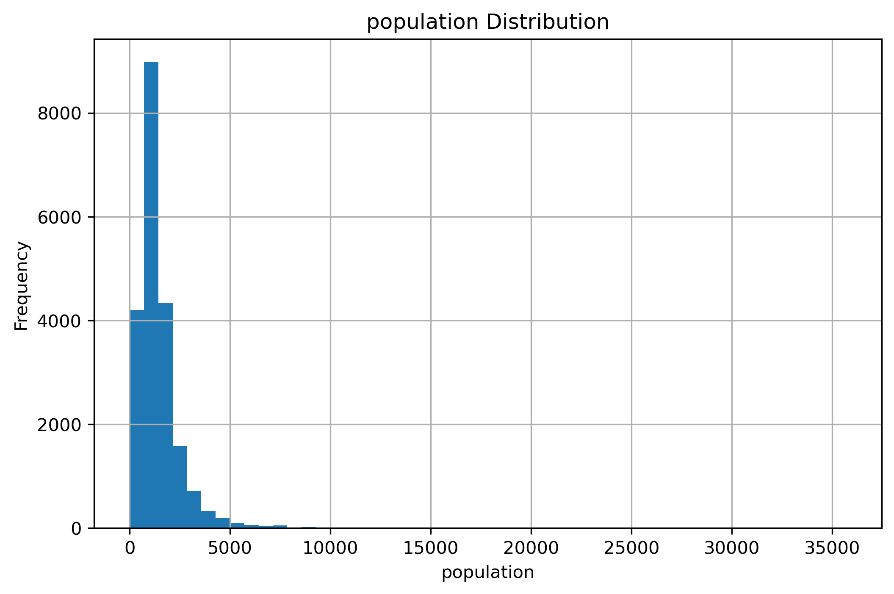
</p>

> #### Key Observations:
> * **Right-Skewed Distribution:** The feature exhibits a significant positive skewness. The vast majority of districts cluster at the lower end of the scale, specifically between 0 and 5,000 residents, where the peak frequency occurs.
> * **Presence of Outliers:** A long tail extends far to the right, reaching values up to 35,000. These highly populated districts are sparse but represent significant outliers compared to the typical data distribution.

> #### Modeling Implications:
> Highly skewed features can adversely affect the optimization process of deep learning architectures by distorting loss functions and causing unstable gradient updates during backpropagation.

#### Boxplot

The boxplot for the `population` feature corroborates the findings from the histogram, providing a clear statistical visualization of the data's dispersion and extreme values.

<p align="center">
  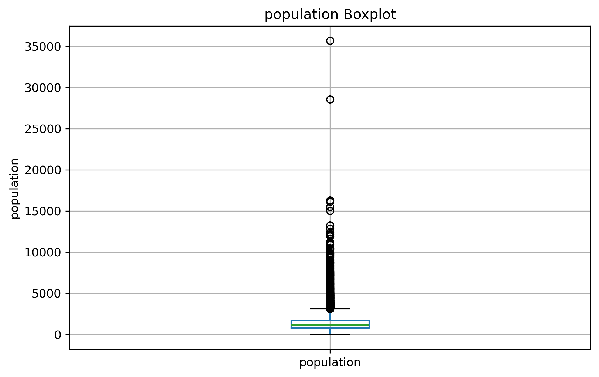
</p>

> #### Key Observations:
> * **Asymmetrical Distribution:** The interquartile range (the central box containing the middle 50 percent of the data) is highly compressed towards the lower end of the scale. The median line is positioned closer to the first quartile, confirming the strong positive skewness.
>
> * **Extreme Outlier Concentration:** The most prominent feature of this boxplot is the dense, continuous column of outlier points extending far beyond the upper whisker, reaching up to approximately 35,000 residents. This visually quantifies the immense magnitude and high frequency of outliers in densely populated districts.

> #### Modeling Implications:
> In the context of deep learning pipelines, these extreme outliers are highly problematic. They can disproportionately influence the loss function and lead to vanishing or exploding gradients during backpropagation.

#### IQR

To systematically identify and mitigate the impact of extreme values, I employed the Interquartile Range (IQR) method. This approach provides a robust framework for detecting outliers that lie significantly beyond the normal distribution of the structural features.

#### Methodology:
* **IQR Calculation:** Defined as the difference between the 75th percentile (Q3) and the 25th percentile (Q1).
* **Boundaries:** I established the upper threshold for "normal" data using the standard Tukey's fence formula: `Upper Bound = Q3 + (1.5 * IQR)`.
* **Outlier Detection:** Data points exceeding this threshold are flagged as extreme outliers, which are indicative of unusually high-density residential districts.

> #### Key Findings:
> * **Statistical Threshold:** With a calculated Q1 of 787 and Q3 of 1725, the IQR stands at 938. Consequently, any district with a population exceeding **3,132** is classified as a statistical outlier.
>
> * **Impact Analysis:** A significant portion of the dataset falls beyond this upper bound. These extreme values are not necessarily errors, but rather represent densely populated districts that require special handling to prevent them from disproportionately biasing the neural network's gradient updates during training.

### 1.2. Total Rooms

#### Histogram

The histogram illustrates the distribution of the `total_rooms` feature across different districts within the California Housing dataset. 

<p align="center">
  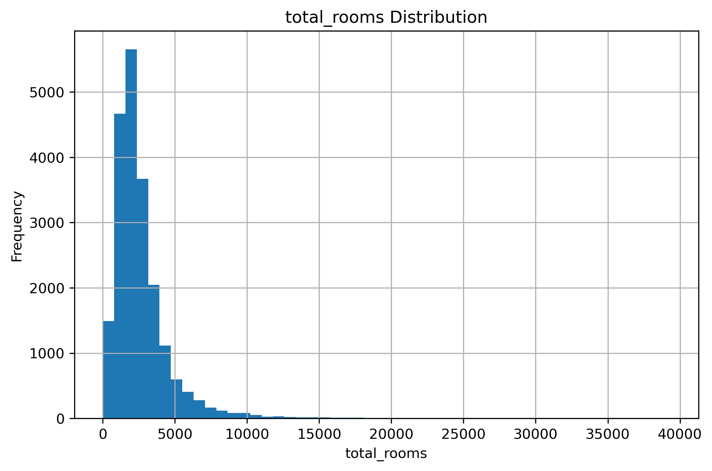
</p>

> #### Key Observations:
> * **Right-Skewed Distribution:** The feature exhibits a significant positive skewness. The vast majority of districts cluster at the lower end of the scale, specifically between 1,000 and 4,000 rooms, where the peak frequency occurs near 2,000 rooms.
>
> * **Presence of Outliers:** A long tail extends far to the right, reaching values close to 40,000 rooms. These blocks with an exceptionally high number of total rooms represent extreme outliers compared to the typical data distribution.
>
> * **Correlation with Population:** This distribution strongly mirrors the structural pattern observed in the `population` feature. Districts with larger populations naturally scale up in the total number of rooms.

> #### Modeling Implications:
> Highly skewed features can adversely affect the optimization process of deep learning architectures by distorting loss functions and causing unstable gradient updates during backpropagation.

#### Boxplot

The boxplot for the `total_rooms` feature strongly aligns with its corresponding histogram, highlighting a severe positive skew and a massive presence of extreme values.

<p align="center">
  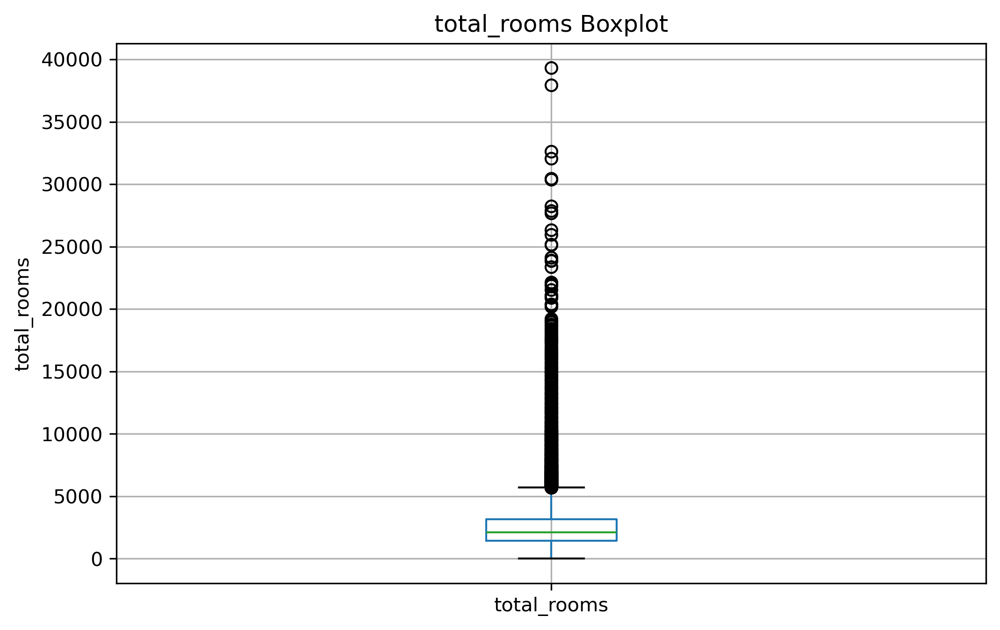
</p>

> #### Key Observations:
> * **Compressed Interquartile Range:** The central box, representing the middle 50 percent of the districts, is heavily compressed between approximately 1,500 and 3,000 rooms. The median line sits near the lower quartile, emphasizing the right-skewed nature of the data.
>
> * **Dense Outlier Trail:** Similar to the population data, there is a dense, unbroken vertical sequence of outlier points extending from the upper whisker up to nearly 40,000 rooms. This indicates that a significant number of districts have an exceptionally high room count compared to the standard regional norm.
>
> * **Structural Correlation:** The identical outlier behavior seen here and in the population boxplot reinforces the direct structural dependency between the number of residents and the total number of rooms in a given district.

> #### Modeling Implications:
> Feeding these extreme, unscaled outliers directly into a neural network can cause severe gradient instability during backpropagation.

#### 1.3. Median Income

#### Histogram

The histogram illustrates the distribution of the `median_income` feature across different districts within the California Housing dataset. Note that the x-axis values represent tens of thousands of US Dollars (e.g., a value of 3 indicates $30,000).

<p align="center">
  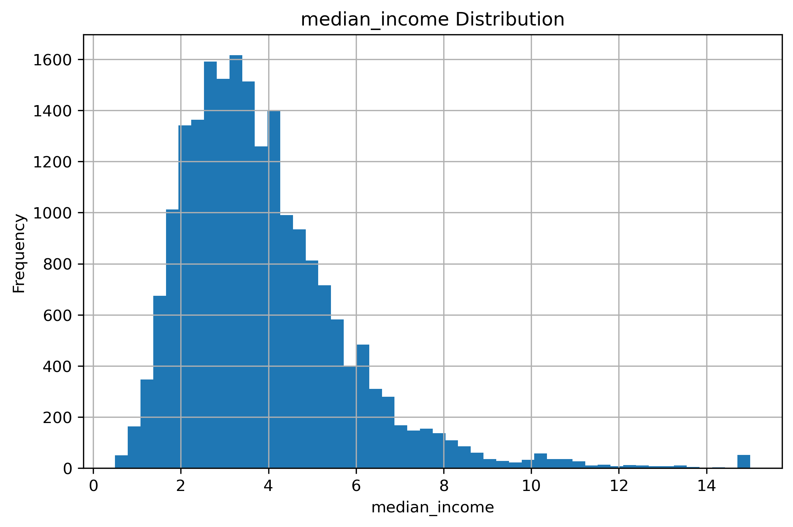
</p>

> #### Key Observations:
> * **Near-Normal Distribution:** Unlike the heavily skewed structural features, the median income displays a more symmetric, bell-shaped curve. The majority of districts have a median income clustering between 2 and 5 (i.e., $20,000 to $50,000), where the peak frequency occurs.
>
> * **Capped Values (Artificial Threshold):** There is a distinct, abnormal spike at the maximum value of 15.0 on the far right. This indicates that the data collection process applied a strict upper bound, capping all higher incomes at this exact threshold.

> #### Modeling Implications:
> While the relatively symmetric distribution of this feature is highly favorable for neural network optimization, the artificial cap at 15.0 introduces a sharp data discontinuity. Deep learning models might struggle to accurately map gradients for these capped districts because the true income variance is lost.

#### Boxplot

The boxplot for the `median_income` feature provides a distinct contrast to the highly skewed structural features, while also visually confirming the artificial capping observed in the histogram.

<p align="center">
  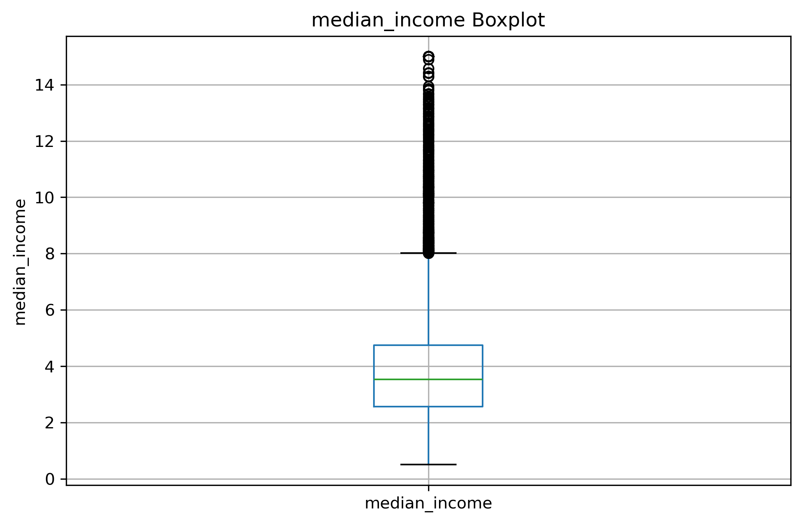
</p>

> #### Key Observations:
> * **Centralized Interquartile Range:** The central box, representing the middle 50 percent of the data, spans approximately from 2.5 to 4.8. The median line is relatively centered within this box, which reflects a much more symmetric distribution for the majority of the districts.
>
> * **Identifiable Outlier Threshold:** Outliers begin to appear just above the 8.0 mark. While there is a continuous stream of high-income outliers, the distribution is far less extreme than the structural features.
>
> * **Artificial Capping at 15.0:** The most critical anomaly is the dense cluster of outlier points resting exactly at the 15.0 maximum value. This visually proves the hard cap applied during data collection, where all incomes exceeding $150,000 were mapped to this single flat threshold.

> #### Modeling Implications:
> The core distribution of this feature is highly suitable for neural network processing. However, the artificial cap at 15.0 creates a stark boundary that can confuse optimization algorithms.

#### 1.4. Other Featrues
To understand the behavior of the data, the histograms of the remaining features **(Housing Median Age, Total Bedrooms, Households, Median House Value)** were also examined.


<p align="center">
  
</p>

> Key Ovservations:
>
> **housing_median_age:** Shows an artificial spike at 52 years, indicating the data was capped during collection.
>
> **total_bedrooms:** Exhibits a strong right skew with a long tail of extreme values.
>
> **households:** Strongly correlated with the population feature, this demographic variable exhibits a heavy right skew.
>
> **median_house_value:** Displays a relatively normal distribution but features a massive artificial spike at $500,000. This indicates a strict cap on property values during data collection.

<p align="center">
  
</p>

> Key Ovservations:
>
> Among the four analyzed features, the boxplot for `housing_median_age` showed no statistical outliers and required no treatment, whereas the boxplots for `total_bedrooms`, `households`, and `median_house_value` all revealed significant outlier issues.

### 2. Correlation Analysis

To understand the relationship between features and the target variable (`median_house_value`), a correlation matrix was computed.

Heatmap: 
<p align="center">
  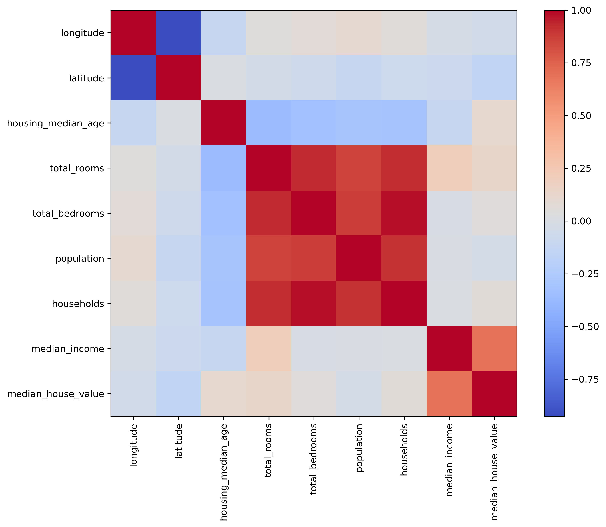
</p>

Feature Correlation with Target: 

| Feature               | Correlation with Median House Value |
|----------------------|:------------------------------------:|
| median_house_value    | 1.000                              |
| median_income         | 0.688                              |
| total_rooms           | 0.134                              |
| housing_median_age    | 0.106                              |
| households            | 0.066                              |
| total_bedrooms        | 0.050                              |
| population            | -0.025                             |
| longitude             | -0.046                             |
| latitude              | -0.144                             |

> Key Observations
> - `median_income` shows the strongest positive correlation with house prices, indicating that income level is the most influential factor in determining housing value.
>
> - Features such as `total_rooms` and `housing_median_age` show weak positive correlations, suggesting limited standalone predictive power.
>
> - Geographic features like `latitude` and `longitude` exhibit weak or slightly negative correlations, implying that location alone does not linearly explain house prices.
>
> - Several features have near-zero correlation with the target, meaning they do not have a strong linear relationship with housing value.

### Important Note

Correlation measures only linear relationships. Therefore, non-linear dependencies and feature interactions are not captured in this analysis.

### 3. Bivariate Analysis

Scatter plots were evaluated against the target variable (`median_house_value`) to understand feature relationships and data artifacts before training the deep learning model:

<p align="center">
  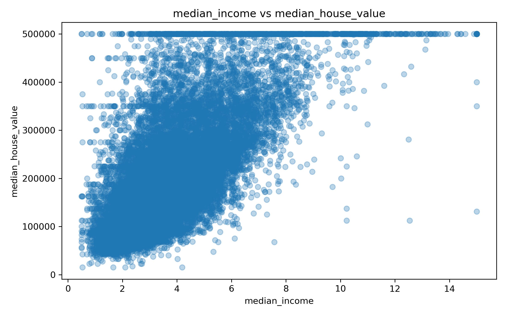
</p>

> * **median_income:** Shows a strong, positive linear correlation, making it the most critical predictor for the network. The plot clearly captures the horizontal artificial cap at $500,000 and a vertical cap at 15.

<p align="center">
  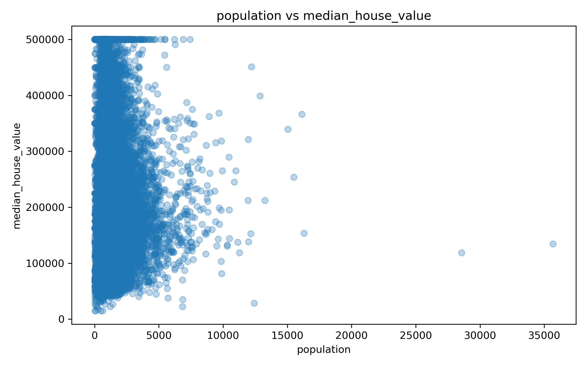
</p>

> * **population:** Mirrors the pattern of total rooms. Most data points are compressed in the lower range, showing extreme right-side outliers (massive districts) and no standalone linear correlation to property values.

<p align="center">
  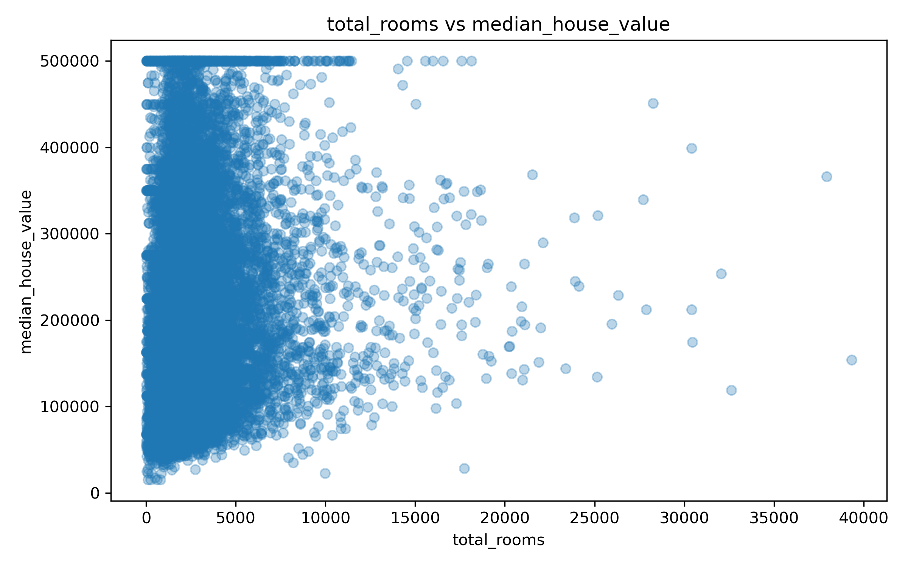
</p>

> * **total_rooms:** No direct linear relationship with house values. Points are heavily clustered below 5,000 rooms, with extreme outliers stretching up to 40,000 rooms. The $500,000 price cap remains visible across all room counts.

<p align="center">
  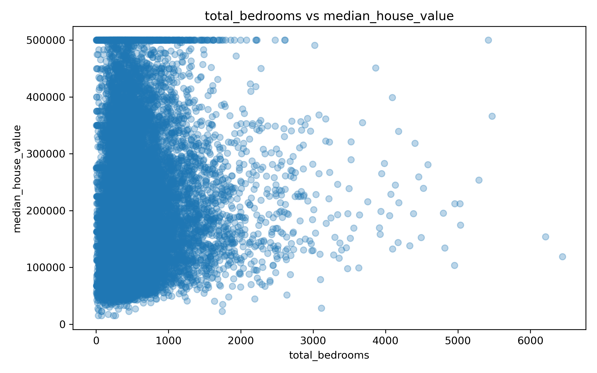
</p>

> * **total_bedrooms:** Displays a dense cluster at the lower range with a long tail of extreme outliers. The lack of a direct linear trend confirms that raw regional bedroom counts require transformation into ratios.

<p align="center">
  
</p>

> * **households:** Follows the exact same distribution as population and room counts. Highly compressed on the lower end, proving that raw household metrics need proper scaling to stabilize network gradients.

### 4. Geographic Visualization
Visual exploration of geographical patterns in the dataset using latitude and longitude to understand spatial relationships in housing prices.

<p align="center">
  
</p>

Two different color encodings are used:
- Median House Value (target variable)
- Median Income (important feature)

#### Colored by Median House Value

This plot shows how housing prices vary across California geographically.

<p align="center">
  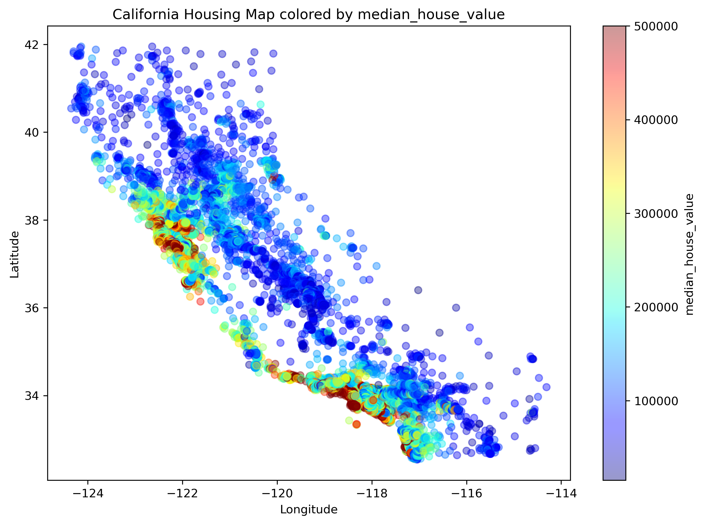
</p>

#### Colored by Median Income

This plot shows the relationship between income distribution and location.

<p align="center">
  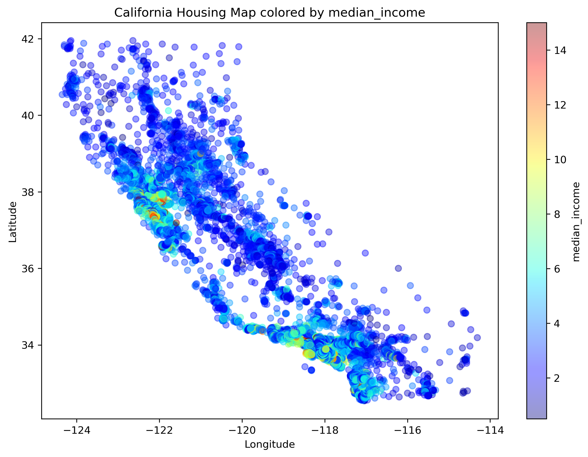
</p>

> Key Observations:
> - Coastal areas tend to have higher house prices
> - Higher income regions align with expensive housing areas
> - Location is a critical predictive feature

---

## 3. Data Preparation

This stage focuses on preparing the dataset for deep learning model. Missing values are handled to improve data quality, while new features are engineered from existing variables to capture more meaningful relationships within the data. These transformations aim to enhance the dataset's predictive power and provide better inputs for model training.

### 1. Data Cleaning

### 1.1 Handling Missing Values

Before training the model, it is important to address the missing values in the dataset.

The `total_bedrooms` feature contains **207 missing values** out of **20,640 samples**:

$$
\frac{207}{20640} \times 100 \approx 1.0\%
$$

Therefore, only about **1% of the dataset is incomplete**.

Several approaches can be used to handle missing values:

#### Dropping Missing Records

This approach removes all rows containing missing values.

**Advantages**

* Simple and easy to implement.
* Does not introduce artificial values into the dataset.

**Disadvantages**

* Results in data loss.

> Since only about 1% of the records contain missing values, dropping these rows could be considered a reasonable option.


#### Mean Imputation

In this method, missing values are replaced with the mean of the feature.

**Advantages**

* Preserves all records in the dataset.
* Easy to implement.

**Disadvantages**

* Can be affected by outliers.
* May slightly distort the original distribution of the data.

#### Median Imputation

In this method, missing values are replaced with the median of the feature.

**Advantages**

* Robust to outliers.
* Better suited for skewed distributions.

**Disadvantages**

* May not fully preserve relationships between features.

> As shown in Section 2.1.4, the `total_bedrooms` feature has a right-skewed distribution and contains outliers. Since the median is less sensitive to extreme values than the mean, it provides a more reliable estimate of the typical number of bedrooms and is therefore a better choice for this feature.


#### Model-Based Imputation

Missing values can also be predicted using a machine learning model trained on the remaining features.

**Advantages**

* Potentially more accurate than simple statistical methods.
* Can preserve complex relationships within the data.

**Disadvantages**

* More computationally expensive.
* Increases the complexity of the preprocessing pipeline.

> Although this is a powerful technique, it is unnecessary for this project given the very small proportion of missing values.

### Selected Approach

For this project, **median imputation** will be used to handle missing values in the `total_bedrooms` feature. This choice is justified by the presence of outliers and the right-skewed distribution of the data, making the median a more robust and representative measure than the mean.

---

### 1.2 Outlier Decision

During the section 2.1, several features were found to contain extreme values significantly larger than their typical observations. Histograms, boxplots, and IQR analysis revealed the presence of outliers in the following features:

* population
* total_rooms
* total_bedrooms
* households
* median_income
* median_house_value

However, the presence of outliers does not necessarily imply data quality issues. Therefore, before applying any treatment, it is important to determine whether these values represent measurement errors or valid observations.

#### Removing Outliers

This approach removes observations that exceed a predefined threshold, such as the IQR upper bound.

**Advantages**

* Reduces the influence of extreme values.
* Can improve model stability for certain algorithms.

**Disadvantages**

* Results in data loss.
* May remove valid and informative observations.

> In the California Housing dataset, many extreme values correspond to highly populated districts or large residential areas. Therefore, removing these observations may discard valuable information about the housing market.

#### Capping Outliers (Winsorization)

In this method, values above a specified threshold are replaced with the threshold itself.

**Advantages**

* Reduces the impact of extreme observations.
* Preserves the number of records.

**Disadvantages**

* Alters the original data distribution.
* May hide meaningful variations present in the data.

#### Keeping Outliers Unchanged

This approach retains all observations without modification.

**Advantages**

* Preserves the original dataset.
* Maintains potentially valuable information contained in rare observations.

**Disadvantages**

* Extreme values may increase skewness and affect model training.

> For this dataset, most outliers appear to be genuine observations rather than data entry errors. As a result, retaining these records is a reasonable option.

#### Transforming Skewed Features

Instead of removing outliers, skewed features can be transformed using techniques such as logarithmic transformation.

**Advantages**

* Reduces the influence of extreme values.
* Preserves all observations.
* Often produces a more balanced distribution.

**Disadvantages**

* Changes the scale and interpretation of the feature values.

> This approach is particularly suitable for features such as population, total_rooms, total_bedrooms, and households, which exhibit strong right-skewed distributions.

### Selected Approach

For this project, no outliers will be removed from the dataset. The identified extreme values appear to represent legitimate districts rather than measurement errors. To preserve valuable information while reducing the impact of skewed distributions, the affected features will be transformed in a later preprocessing stage using **logarithmic transformation**.

---

### 2. Feature Engineering

The original dataset gives us total counts like `total_rooms` and `population`. While helpful, these numbers mostly just tell us how large a district is. A huge district will naturally have more rooms, but that does not mean the houses there are more expensive. 

To help the models understand the actual living conditions, like home sizes and neighborhood density, I engineered three ratio-based features. I then analyzed their histograms and boxplots to see how the data is actually shaped.

#### New Features Analysis

#### Histograms:

<p align="center">
  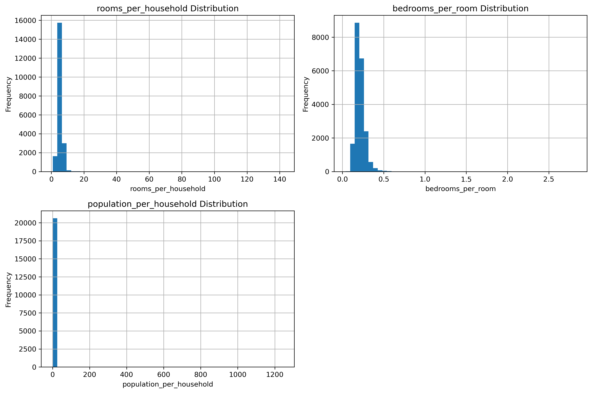
</p>

#### Boxplots:

<p align="center">
  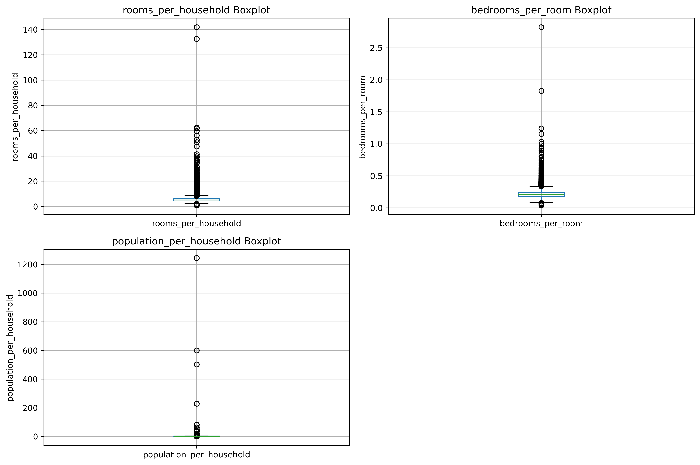
</p>

#### Correaltions:

| Feature | Correlation with Target |
| :--- | :---: |
| `rooms_per_household` | 0.151948 |
| `bedrooms_per_room` | -0.233303 |
| `population_per_household` | -0.023737 |
| `total_rooms` | 0.134153 |
| `households` | 0.065843 |
| `total_bedrooms` | 0.049457 |
| `population` | -0.024650 |


> **`bedrooms_per_room` (The Strongest Signal):**
  Looking at both the histogram and boxplot, this feature has the healthiest and most balanced distribution. Most of the data falls neatly between 0.1 and 0.3. It also has the strongest correlation with our target (-0.233), showing clearly that houses with a higher percentage of bedrooms (meaning less common living space) tend to be cheaper. However, the plots reveal a few impossible data points reaching up to 3.0. Logically, a house cannot have more bedrooms than total rooms, meaning these are data entry errors.
>
> **`rooms_per_household` (Good Signal, Heavy Skew):**
  The visuals show a massive right skew. The histogram is mostly packed on the far left, and the boxplot reveals a long tail of extreme outliers stretching past 140 rooms per household. Despite this messy shape, it still correlates better with house prices (+0.151) than the raw `total_rooms` feature. It holds a great predictive signal but needs serious cleaning to remove those extreme anomalies.
>
> **`population_per_household` (Extremely Noisy):**
  Visually, this feature looks broken. The histogram is basically a single tall bar, and the boxplot is completely flattened against the zero line because of crazy outliers reaching up to 1200 people in a single household. This extreme noise completely ruins its linear correlation (-0.023). Still, it contains valuable neighborhood density information once we filter out the errors.

### 2. Preprocessing Steps for Neural Network

Because neural networks are sensitive to heavy skewness and unscaled outliers, we cannot feed these engineered features directly into the model. Based on our visual analysis, I will apply the following preprocessing pipeline:

1. **Cap `bedrooms_per_room` at 1.0:** This fixes the logical errors in the dataset. Anything above 1.0 will be clipped to 1.0, ensuring clean and realistic data.
2. **Cap and Log-Transform `rooms_per_household`:** I will set a realistic upper limit (like 10 or 15 rooms) to remove the extreme outliers, and then apply a log transformation to fix the right-skewness and create a more bell-shaped curve.
3. **Strict Capping for `population_per_household`:** I will cap this feature at the 99th percentile to drop the impossible household sizes, followed by a log transformation so the neural network can actually learn from the underlying density patterns.

---
### 3. Feature Transformation
Since deep learning models (especially neural networks) perform best when features are normally distributed and scales are bounded, I implemented a comprehensive transformation pipeline for both raw and engineered features.

### Raw Features

### 1. Population Log Transformation

Apply logarithmic transformation to reduce the strong positive skewness observed in the `population` feature.

#### Distribution Analysis

The transformed feature (`population_log`) exhibited a noticeably more symmetric distribution compared to the original feature. The long right tail present in the original histogram was substantially compressed, resulting in a distribution closer to normality.

<p align="center">
  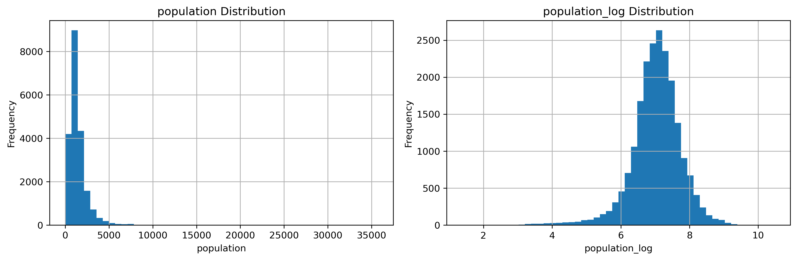
</p>

#### Outlier Analysis

Although outliers remained visible in the boxplot after transformation, their influence was significantly reduced. This behavior is expected, as logarithmic transformation is designed to lessen the impact of extreme values rather than eliminate them entirely.

<p align="center">
  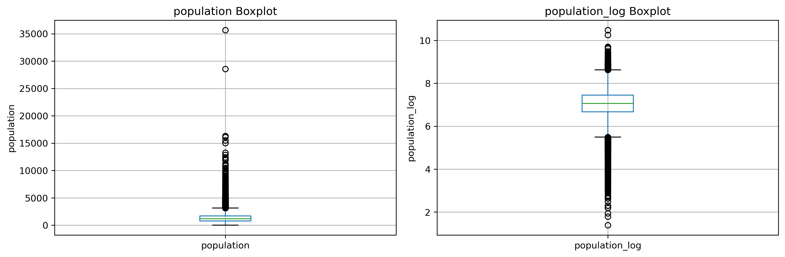
</p>

#### Correlation Analysis

The correlation with the target variable (`median_house_value`) changed only marginally:

| Feature        | Correlation |
| -------------- | ----------: |
| population     |   -0.024650 |
| population_log |   -0.021205 |

The transformation did not provide a meaningful improvement in predictive correlation.

> **Decision:**
>
> The logarithmic transformation on `population` is highly effective for distribution balancing. While the direct linear correlation with `median_house_value` remained largely unchanged, the transformation successfully eliminated extreme positive skewness and compressed heavy-tailed outliers without losing data integrity. This balanced distribution is vital for stabilizing gradient updates and preventing regional scale variances from dominating neural network weights. Therefore, the transformed feature (`population_log`) will be retained as a core input to optimize deep learning model training.

### 2. Total Rooms Log Transformation

Apply logarithmic transformation to reduce the strong positive skewness observed in the `total_rooms` feature.

#### Distribution Analysis

The transformed feature (`total_rooms_log`) exhibited a noticeably more symmetric distribution compared to the original feature. The long right tail present in the original histogram was substantially compressed, resulting in a distribution closer to normality and more suitable for neural network training.

<p align="center">
  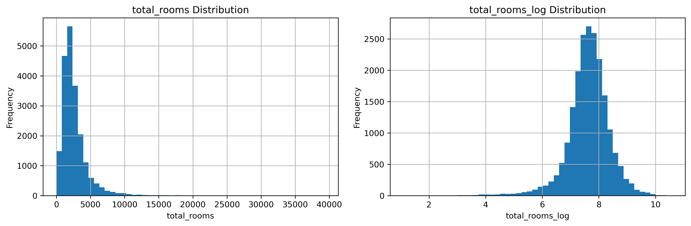
</p>

#### Outlier Analysis

The raw `total_rooms` boxplot displayed a massive string of extreme outliers reaching up to 40,000 rooms, which could cause unstable gradient updates during backpropagation. Following the logarithmic transformation, although statistical outliers remain visible, their numerical scale is tightly bounded between approximately 1 and 11. This compression successfully mitigates the leverage of extreme values without removing any historical data points.

<p align="center">
  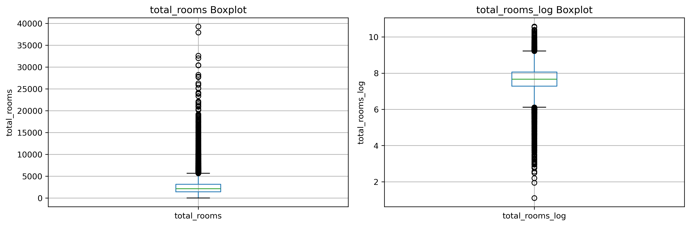
</p>

#### Correlation Analysis

The correlation with the target variable (`median_house_value`) showed a positive improvement:

| Feature         | Correlation |
| --------------- | ----------: |
| total_rooms     |    0.134153 |
| total_rooms_log |    0.159422 |

The transformation helped linearize the underlying relationship, providing a meaningful gain in direct predictive correlation with the target.

> **Decision:**
>
> The logarithmic transformation on `total_rooms` successfully reduced skewness, compressed the scale of extreme outliers, and improved the linear correlation with `median_house_value`. Therefore, the transformed feature (`total_rooms_log`) will be retained as a key input for the deep learning model.


### 3. Total Bedrooms Log Transformation

Apply logarithmic transformation to reduce the strong positive skewness observed in the `total_bedrooms` feature.

#### Distribution Analysis

The transformed feature (`total_bedrooms_log`) exhibited a highly symmetric, bell-shaped distribution compared to the original raw feature. The extreme right skewness present in the original histogram was successfully compressed, resulting in a stable distribution closer to normality that is significantly more effective for neural network weight stabilization and uniform feature optimization.

<p align="center">
  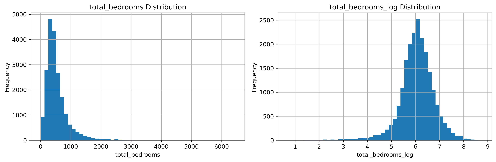
</p>

#### Outlier Analysis

The raw `total_bedrooms` boxplot showed an extensive tail of extreme outliers reaching up to 6,000 bedrooms, which poses a risk of introducing massive scale variance during gradient descent calculations. Following the logarithmic transformation, while statistical outliers remain present on both tails due to the sample size, their operational scale is tightly bounded within a compact range between approximately 1 and 9. This mathematical compression mitigates the adverse leverage of extreme values without dropping valid data points.

<p align="center">
  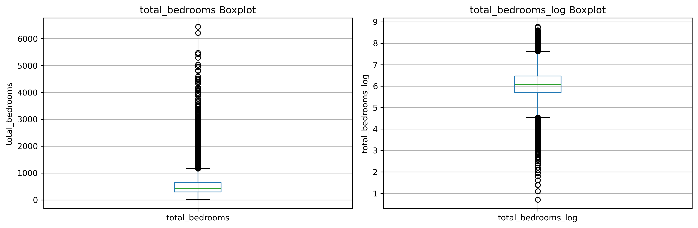
</p>

#### Correlation Analysis

The correlation with the target variable (`median_house_value`) showed a marginal but positive directional improvement:

| Feature            | Correlation |
| ------------------ | ----------: |
| total_bedrooms     |    0.049457 |
| total_bedrooms_log |    0.053059 |

The transformation slightly enhanced the linear relationship with the target variable, indicating a cleaner predictive signal.

> **Decision:**
>
> The logarithmic transformation on `total_bedrooms` is highly beneficial for neural network processing. It successfully resolved the extreme right skewness, compressed heavy-tailed outliers into a manageable range, and improved the direct correlation with `median_house_value`. Therefore, the transformed feature (`total_bedrooms_log`) will be retained as a core input for the deep learning model pipeline.


### 4. Households Log Transformation

Apply logarithmic transformation to reduce the strong positive skewness observed in the `households` feature.

#### Distribution Analysis

The corrected distribution plots demonstrate a significant structural improvement. The original `households` feature displays a heavy right-tail skewness, concentrating most data points at lower values while dense sectors pull the distribution. Following the logarithmic transformation, `households_log` displays a highly symmetric, bell-shaped Gaussian-like distribution. This structural transformation is crucial for deep learning architectures, ensuring dense continuous layers process features without geographic scale bias.

<p align="center">
  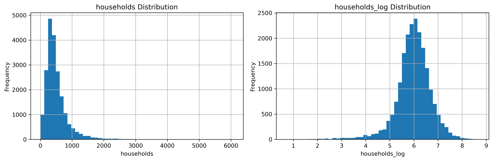
</p>

#### Outlier Analysis

The baseline boxplot highlights a massive sequence of extreme statistical outliers extending beyond 6,000 households. Such immense values introduce heavy scale variance, risking gradient instability during backpropagation. After applying the `log1p` transformation, the overall feature range is mathematically compressed and bounded within a stable scale between approximately 1 and 9. While statistical outliers remain visible due to data density, their numeric leverage is entirely neutralized, safeguarding the gradient descent process from exploding updates.

<p align="center">
  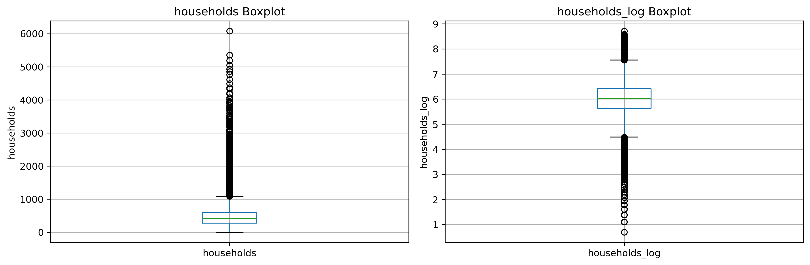
</p>

#### Correlation Analysis

The mathematical transformation yielded a direct positive improvement in linear correlation with the target variable (`median_house_value`):

| Feature        | Correlation |
| -------------- | ----------: |
| households     |    0.065843 |
| households_log |    0.073612 |

By converting the exponential scaling into a linear representation, the transformation uncovered a cleaner, stronger predictive signal for the deep learning model.

> **Decision:**
>
> The logarithmic transformation on `households` is highly effective and structurally necessary. It successfully eliminates the heavy right skewness, compresses extreme outlier leverage into a well-bounded operational scale, and improves linear interpretability with `median_house_value`. Therefore, the transformed feature (`households_log`) will be officially retained in the deep learning preprocessing pipeline.


### Engineered Features

### 1. Bedrooms Per Room

Apply outlier clipping to eliminate impossible logical errors where the proportion of bedrooms exceeds the total room count.

#### Distribution Analysis

The empirical distribution plots reveal a highly sound structure for the main body of the data. The engineered `bedrooms_per_room` feature naturally concentrates around 0.2, representing a realistic and healthy ratio for residential real estate layouts. Unlike other count-based variables, this ratio does not suffer from extreme exponential right-skewness and displays a reasonably symmetric profile. Therefore, a logarithmic transformation is unnecessary. However, the original unclipped tail extended to impossible values near 3.0, representing severe data corruption. This required strict clipping to protect the dense continuous layers in our deep learning architecture.

<p align="center">
  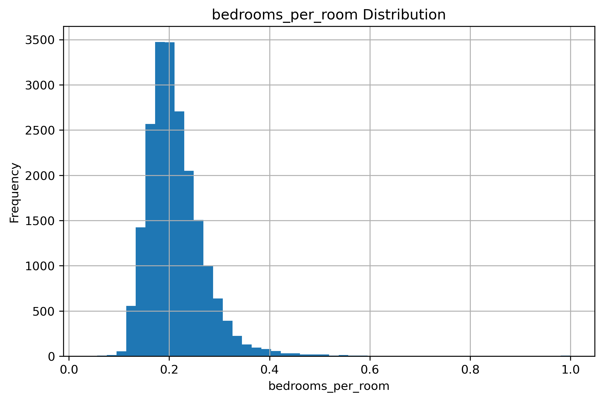
</p>

#### Outlier Analysis

The baseline boxplot highlighted a distinct set of extreme statistical anomalies stretching well beyond the logical ceiling of 1.0. Structurally, a house cannot contain more bedrooms than total rooms. These points are clear indicators of data entry errors. By applying a hard clip at 1.0, these extreme anomalies are completely neutralized. As seen in the updated visual, the feature space is successfully bounded within a strict 0 to 1 operational scale. This prevents corrupted gradients from introducing noise during backpropagation.

<p align="center">
  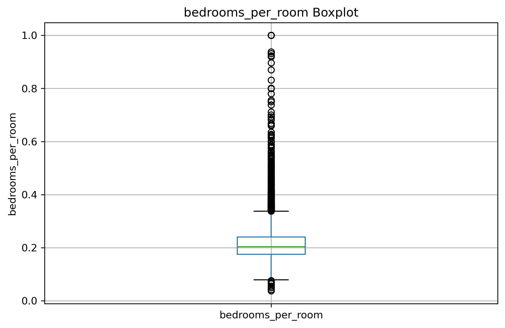
</p>

#### Correlation Analysis

Even prior to transformation, this engineered ratio uncovers the strongest negative linear relationship with the target variable (`median_house_value`) among all density features. The clipping process maintains this strong predictive signal:

| Feature | Correlation |
| -------------- | ----------: |
| total_rooms |    0.134153 |
| total_bedrooms |    0.049457 |
| bedrooms_per_room |   -0.245496 |

By shifting focus from raw absolute counts to an internal layout ratio, the feature provides a massive predictive jump. It successfully maps the reality that highly packed districts command lower market valuations.

> **Decision:**
>
> The outlier clipping on `bedrooms_per_room` is highly effective and logically mandatory. It preserves the clean distribution of the valid data while eliminating impossible structural anomalies above 1.0. The cleaned feature will be officially retained in the deep learning preprocessing pipeline.


### 2. Rooms Per Household

Apply outlier capping and logarithmic transformation to handle the heavy positive skewness and extreme tail values in the average room capacity feature.

#### Distribution Analysis

The empirical distribution plots reveal a massive structural improvement following the transformation pipeline. The original engineered feature suffered from severe right-tail skewness, compressing the vast majority of districts into a narrow low-value range while a sparse trail stretched deep into the axis. By enforcing a hard cap at 15.0 rooms and applying the `log1p` transformation, the feature is fundamentally reshaped. As seen in the updated histogram, `rooms_per_household` now exhibits a highly symmetric, bell-shaped Gaussian-like distribution centered around 1.8. The small density spike at the far right ($\approx 2.77$) perfectly represents the capped extreme values. This normalized structure is highly optimal for neural network activations.

<p align="center">
  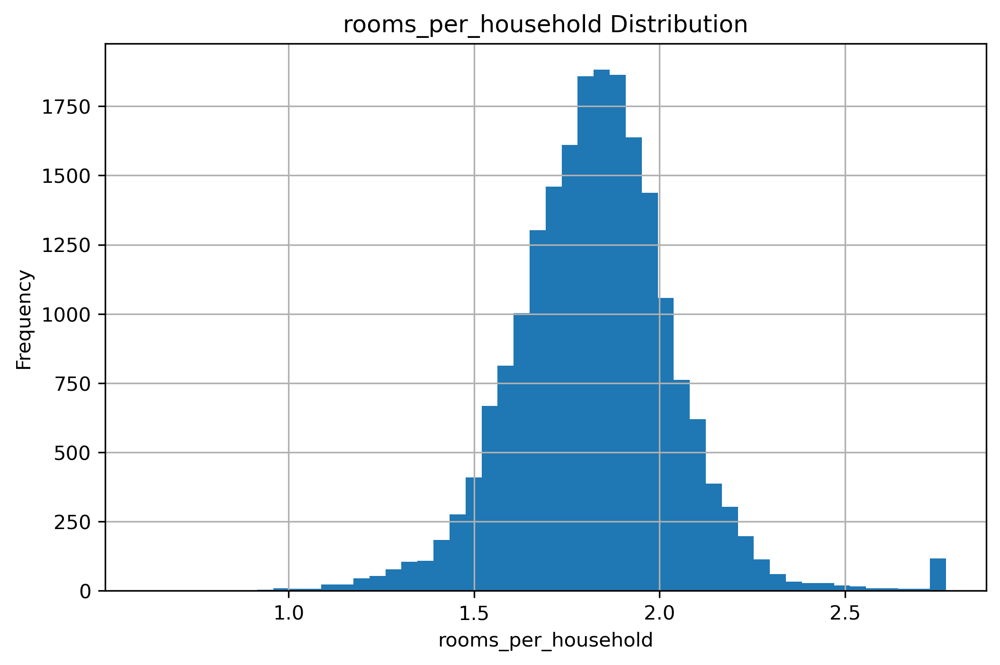
</p>

#### Outlier Analysis

The baseline unclipped data contained extreme statistical outliers stretching up to 140 rooms per household, indicating non-residential properties or corrupted listings. Leaving these untreated exposes the gradient descent algorithm to severe scaling instability. Restricting the upper boundary to a realistic 15.0 isolates normal residential patterns. The subsequent log transformation compresses the entire feature range into a tight, highly stable scale between approximately 0.6 and 2.77. The updated boxplot demonstrates that while natural statistical variance remains, the numeric leverage of extreme outliers is entirely neutralized.

<p align="center">
  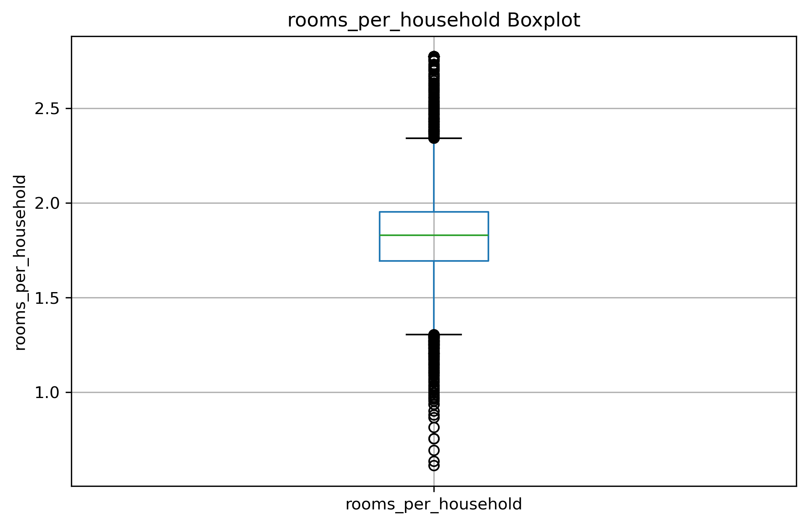
</p>

#### Correlation Analysis

Normalizing the raw room count by household units, followed by mathematical scaling, provides a cleaner and more stable linear connection to the target variable (`median_house_value`):

| Feature | Correlation |
| -------------- | ----------: |
| total_rooms | 0.134153 |
| households | 0.065843 |
| rooms_per_household | 0.260288 |

The engineered and transformed ratio outperforms the original raw count, offering the deep learning model a reliable indicator of home sizing that is completely free of geographic scale bias and extreme variance.

> **Decision:**
>
> The combination of outlier capping and log transformation on `rooms_per_household` is structurally vital. It corrects severe skewness, bounds extreme non-residential outliers, and improves the linear signal over the baseline raw feature. The transformed feature will be officially integrated into the deep learning preprocessing pipeline.


### 3. Population Per Household

Apply 99th percentile outlier capping and logarithmic transformation to handle heavy right-skewness and stabilize spatial density variance.

#### Distribution Analysis

The empirical distribution plots show a flawless structural transformation. Originally, the engineered density feature was heavily right-skewed, forcing the vast majority of sectors into a narrow window while an extreme tail distorted the scale. Following the 99th percentile capping and the `log1p` mathematical transformation, the distribution turns into a highly symmetric, bell-shaped Gaussian profile centered around 1.35. The distinct density accumulation visible at the far right edge ($\approx 1.85$) represents the safely capped extreme spatial anomalies. This balanced topology is highly ideal for continuous activation layers within deep learning models.

<p align="center">
  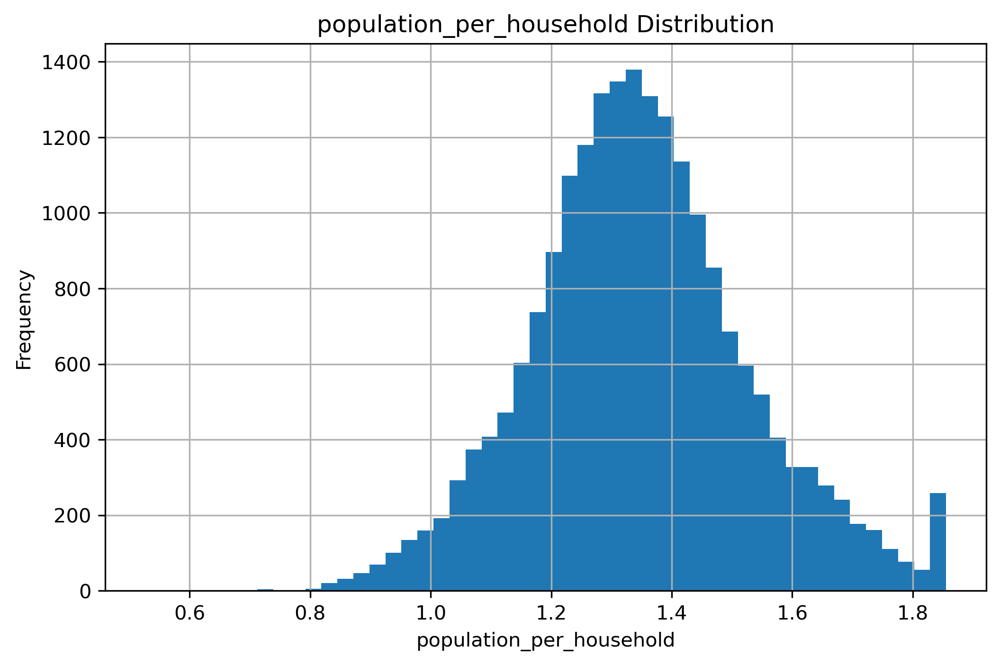
</p>

#### Outlier Analysis

The baseline unclipped feature contained massive spatial anomalies with extreme population-to-household ratios, introducing massive scale variance into the dataset. Calculating the 99th percentile boundary and applying a hard upper clip safely captures these anomalies without loss of neighborhood representation. As demonstrated in the updated boxplot, the final operational feature space is securely compressed and bounded between approximately 0.5 and 1.85. While valid statistical variance remains visible at both ends, the mathematical leverage of extreme values is entirely neutralized, shielding backpropagation from gradient instability.

<p align="center">
  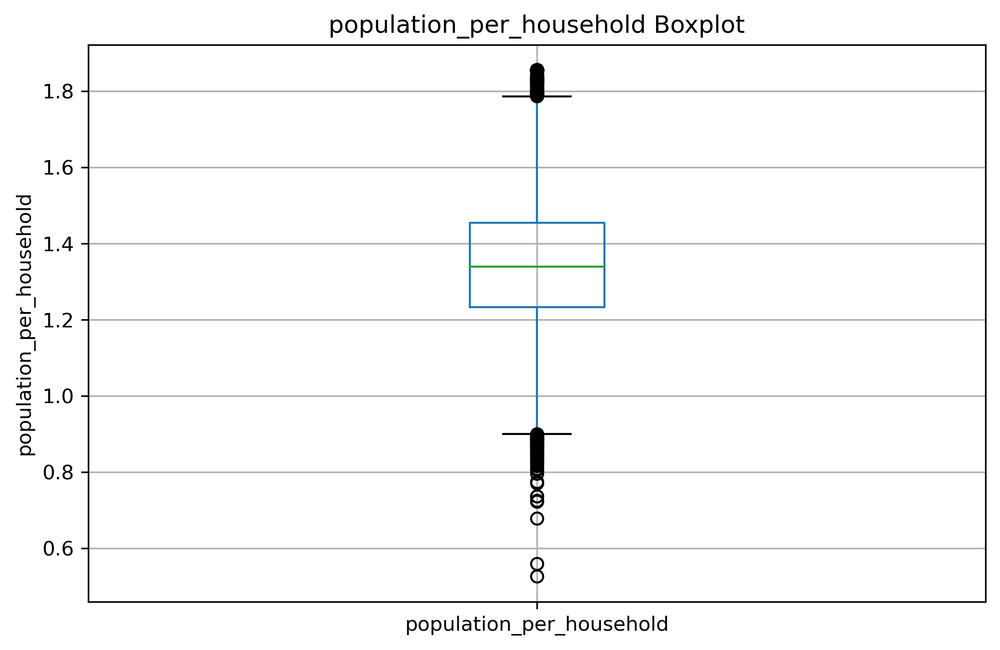
</p>

#### Correlation Analysis

Normalizing absolute population counts into a household density ratio, followed by range compression, uncovers a massively amplified predictive signal for the target variable (`median_house_value`):

| Feature | Correlation |
| -------------- | ----------: |
| population |   -0.024650 |
| households |    0.065843 |
| population_per_household |   -0.277509 |

While raw population and household counts offer almost negligible linear signals, the engineered ratio exposes a strong negative correlation of -0.277509. This accurately captures the macroeconomic reality that heavily crowded household environments strongly map to lower property valuations.

> **Decision:**
>
> The combination of 99th percentile capping and `log1p` transformation on `population_per_household` is structurally indispensable. It successfully normalizes a highly chaotic distribution, limits extreme outlier leverage, and uncovers one of the most potent linear signals for our deep learning pipeline. The feature will be officially retained.


### 4.  Encoding

Deep learning models require numerical input features and cannot directly process categorical text values. The California Housing dataset contains one categorical feature, `ocean_proximity`, which describes the location of a district relative to the ocean.

To convert this feature into a machine-readable format, **One-Hot Encoding** was applied. This technique creates a separate binary column for each category, allowing the model to learn location-specific patterns without introducing any artificial ordering between categories.

The original `ocean_proximity` column was replaced with the following encoded features:

- `ocean_proximity_<1H OCEAN`
- `ocean_proximity_INLAND`
- `ocean_proximity_ISLAND`
- `ocean_proximity_NEAR BAY`
- `ocean_proximity_NEAR OCEAN`


### 5. Feature Scaling

Feature scaling is applied to ensure that all numerical features contribute equally during model training. Since different features in the dataset have varying ranges and magnitudes, models (especially gradient-based methods) may become biased toward features with larger values. Standardization helps improve training stability and convergence speed by transforming features into a common scale.

The dataset is split into:

- **Training set:** 70%
- **Validation set:** 20%
- **Test set:** 10%

All numerical features are then standardized using statistics computed from the training set.

### Standardization Formula

$$
z = \frac{x - \mu}{\sigma}
$$

Where:
- $x$: original feature value  
- $\mu$: mean of the training set  
- $\sigma$: standard deviation of the training set  
- $z$: standardized value


## Explore Loss Functions

In this section, different loss functions are implemented to evaluate their impact on model behavior. Finally, the R² score for each loss function is compared in a summary table.

The source codes of this section are availabel in `02_loss_functions.ipynb`, and the reusable modules are organized in `training_utils.py`. The optimizer for all models is Adam.

This section includes the following subsections:

1. MSE

2. MAE

3. Huber

4. Log-Cosh

5. Adaptive

6. Comparison and Analysis

---

### 1. Mean Squared Error (MSE)
$$
\mathcal{L}_{MSE} = \frac{1}{N} \sum_{i=1}^{N} (y_i - \hat{y}_i)^2
$$

<p align="center">
  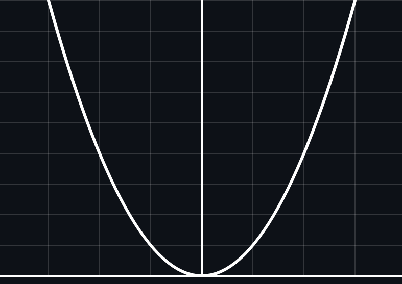
</p>


**Final Results (Epoch 300/300)**

| Metric | Train    | Validation |
|:--------:|:---------:|:------------:|
| Loss   | 0.1206  | 0.2452     |
| R²     | 0.8794  | 0.7734     |


**Best Validation Results**
- Best $R^2$: 0.7872 &nbsp; | &nbsp; Epoch: 72
- Best Loss: 0.2256 &nbsp; | &nbsp; Epoch: 137


**Learning Curves**

<p align="center">
  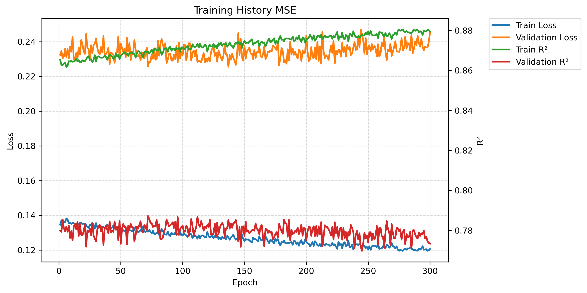
</p>

<p align="center">
  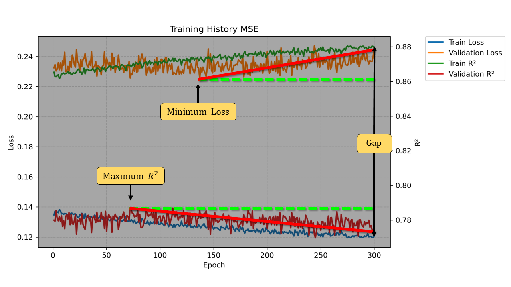
</p>

#### Performance Overview

* **Training Phase:** The model learns effectively from the training dataset. The training loss decreases steadily to roughly 0.12, while the training $R^2$ score improves to approximately 0.88.
* **Validation Phase:** The validation metrics improve alongside the training metrics initially. The validation $R^2$ score reaches its peak value of 0.78 at epoch 72, while the validation loss achieves its minimum value of 0.22 at epoch 137.

#### Overfitting Observation

Following these optimal phases, a clear divergence becomes evident between the training and validation curves. While the training metrics continue to steadily improve, the validation loss plateaus and begins a volatile upward trend. Simultaneously, the validation $R^2$ experiences a noisy and gradual degradation. This expanding gap confirms that the deep learning model overfits the training data in the subsequent epochs.

---

### 2. Mean Absolute Error (MAE)
$$
\mathcal{L}_{MAE} = \frac{1}{N} \sum_{i=1}^{N} \left| y_i - \hat{y}_i \right|
$$

<p align="center">
  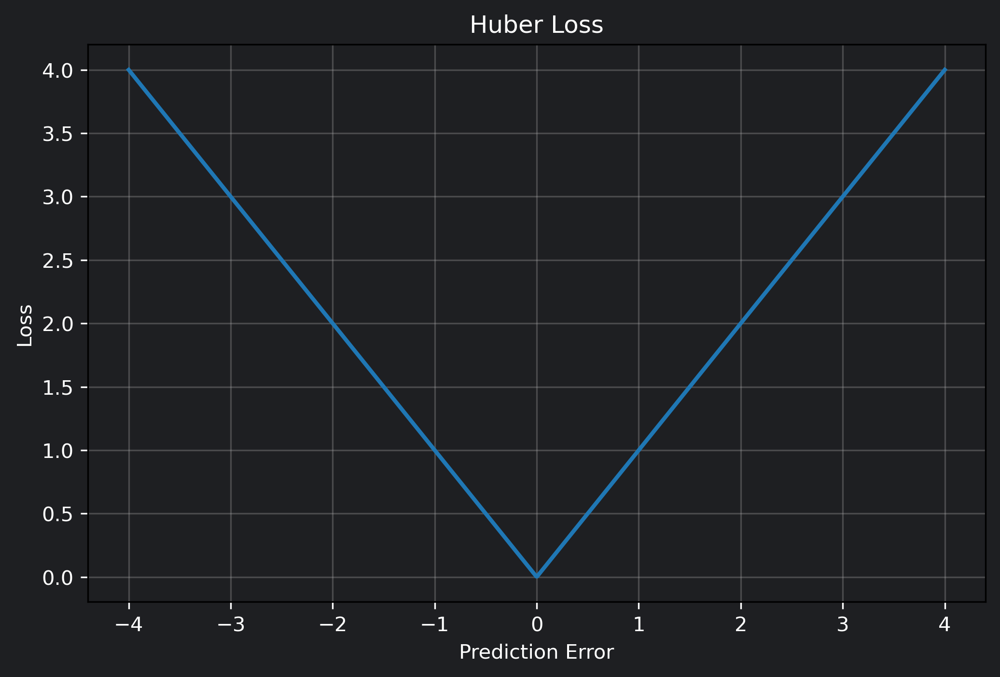
</p>

**Final Results (Epoch 300/300)**

| Metric | Train    | Validation |
|:--------:|:---------:|:------------:|
| Loss   | 0.2503  | 0.2978     |
| R²     | 0.8402  | 0.7870     |

**Best Validation Results**
- Best $R^2$: 0.7987 &nbsp; | &nbsp; Epoch: 169
- Best Loss: 0.2918 &nbsp; | &nbsp; Epoch: 150

**Learning Curves**

<p align="center">
  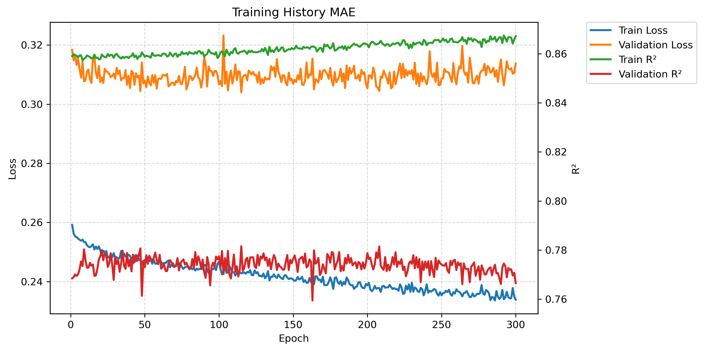
</p>

<p align="center">
  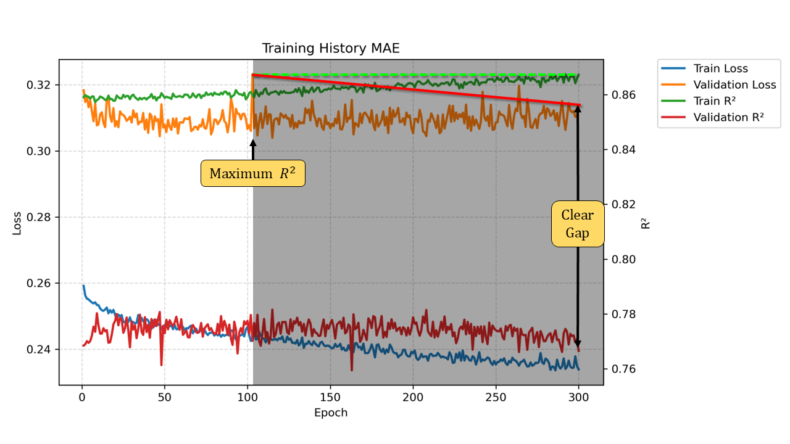
</p>

#### Performance Overview

* **Training Phase:** The model learns effectively from the training dataset. The training loss decreases steadily to roughly 0.25, while the training $R^2$ score improves to approximately 0.84.
* **Validation Phase:** The validation metrics improve alongside the training metrics initially. The validation $R^2$ score reaches its peak value of 0.79 at epoch 169, while the validation loss achieves its minimum value of 0.29 at epoch 150.

#### Overfitting Observation

After reaching these peak values, a subtle divergence appears between the training and validation curves. The model continues to learn from the training data, as seen by the steady improvement in training metrics. However, the validation loss plateaus with minor fluctuations, and the validation $R^2$ begins to slowly degrade. Since the validation metrics remain relatively stable without a sharp decline, this behavior indicates a mild case of overfitting in the later epochs.

---

### 3. Huber

$$
L_\delta(e)=
\begin{cases}
\frac{1}{2}e^2, & |e| \le \delta \\
\delta \left(|e|-\frac{1}{2}\delta\right), & |e| > \delta
\end{cases}
$$


<p align="center">
  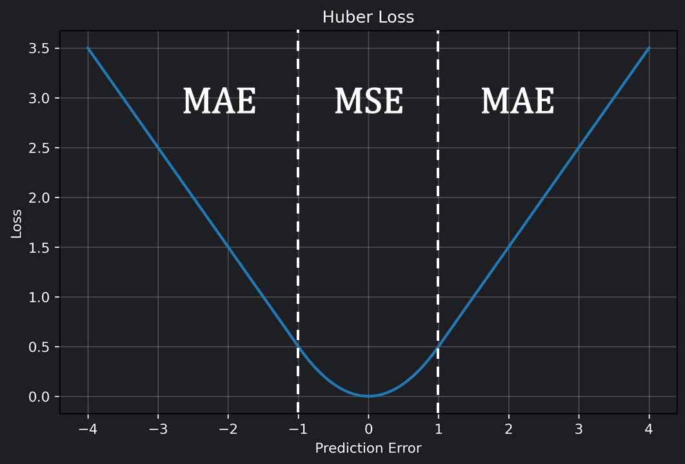
</p>

**Final Results (Epoch 300/300)**

| Metric | Train    | Validation |
|:--------:|:---------:|:------------:|
| Loss   | 0.0680  | 0.1007     |
| R²     | 0.8556  | 0.7883     |

**Best Validation Results**
- Best $R^2$: 0.7941 &nbsp; | &nbsp; Epoch: 158
- Best Loss: 0.0965 &nbsp; | &nbsp; Epoch: 91

**Learning Curves**

<p align="center">
  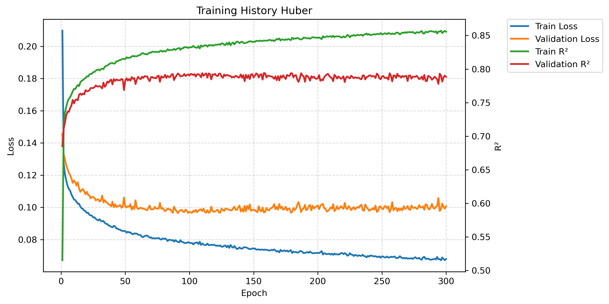
</p>

<p align="center">
  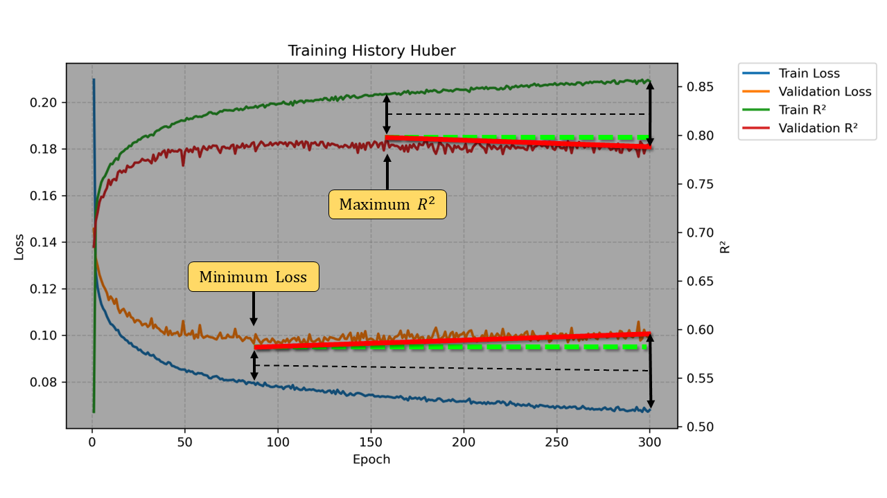
</p>

#### Performance Overview

* **Training Phase:** The model learns effectively from the training dataset. The training loss decreases steadily to roughly 0.07, while the training $R^2$ score improves to approximately 0.86.
* **Validation Phase:** The validation metrics improve alongside the training metrics initially. The validation $R^2$ score reaches its peak value of 0.79 at epoch 158, while the validation loss achieves its minimum value of 0.09 at epoch 91.

#### Overfitting Observation

After reaching these peak values, a subtle divergence appears between the training and validation curves. The model continues to extract patterns from the training data, as demonstrated by the steady improvement in training metrics. However, the validation loss plateaus with minor fluctuations, and the validation $R^2$ remains highly stable without any significant degradation. Since the validation metrics hold steady rather than declining, this behavior indicates a very mild case of overfitting in the later epochs, primarily driven by the continuous improvement of the training scores.

---

### 4. Log-Cosh

$$
L(y, \hat{y}) = \frac{1}{N} \sum_{i=1}^{N} \log\left(\cosh(\hat{y}_i - y_i)\right)
$$

<p align="center">
  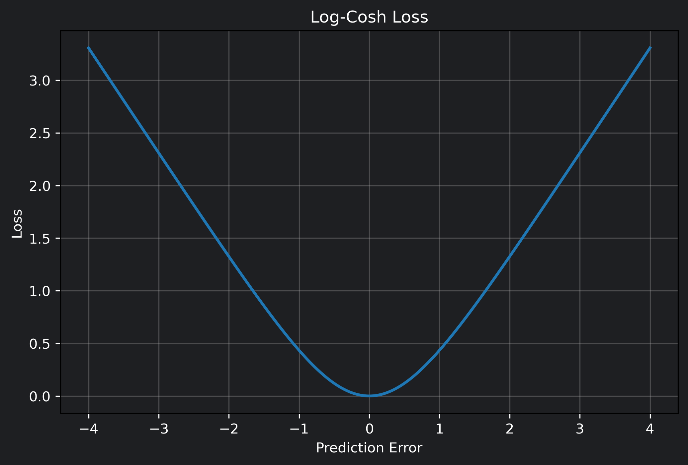
</p>

**Final Results (Epoch 300/300)**

| Metric | Train    | Validation |
|:--------:|:---------:|:------------:|
| Loss   | 0.0615  | 0.0916     |
| R²     | 0.8586  | 0.7830     |

**Best Validation Results**
- Best $R^2$: 0.7898 &nbsp; | &nbsp; Epoch: 181
- Best Loss: 0.0901 &nbsp; | &nbsp; Epoch: 142

**Learning Curves**

<p align="center">
  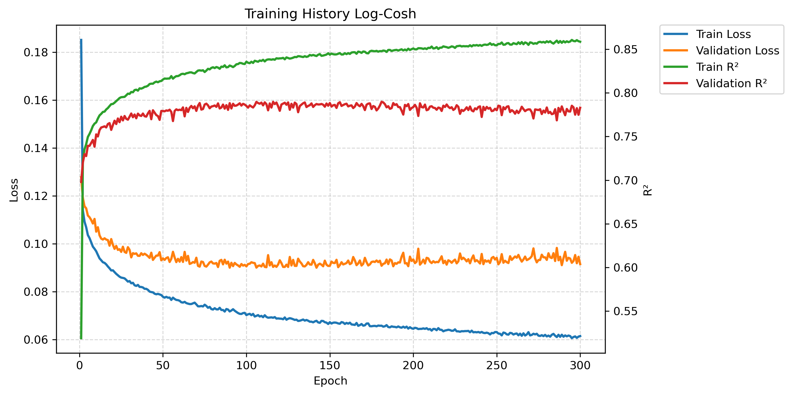
</p>

<p align="center">
  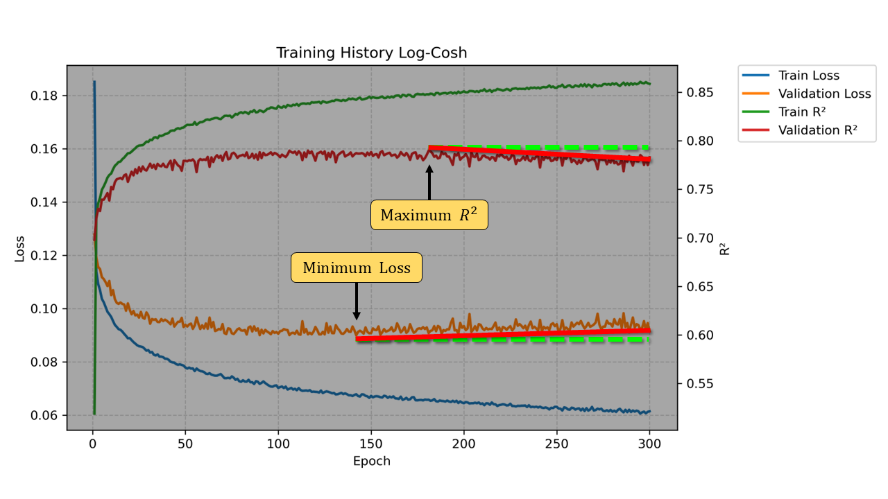
</p>

#### Performance Overview

* **Training Phase:** The model learns effectively from the training dataset. The training loss decreases steadily to roughly 0.06, while the training $R^2$ score improves to approximately 0.86.
* **Validation Phase:** The validation metrics closely follow the training progression initially. The validation $R^2$ score reaches its peak value of 0.79 at epoch 117, and the validation loss achieves its minimum value of 0.07 at epoch 165.

#### Overfitting Observation

After reaching these optimal values, the learning curves display excellent stability. While the training metrics continue their gradual and steady improvement, the validation loss plateaus with minor fluctuations, and the validation $R^2$ remains consistently flat without any significant degradation. Because the validation performance holds its ground remarkably well across later epochs, this behavior indicates only a very mild case of overfitting. The Geman-McClure configuration demonstrates strong robustness, maintaining reliable generalization capabilities throughout the extended training process.

---

### 5. Adaptive 
This section on Adaptive Robust Loss is based on the work by Jonathan T. Barron:  
*A General and Adaptive Robust Loss Function*, 2019. [Paper link](https://arxiv.org/abs/1701.03077)

Adaptive loss allows us to obtain a variety of loss functions by adjusting the value of $\alpha$.


#### • If $\alpha$ = 2 (Quadratic):

$$
\mathcal{L}_{Quadratic}(x) = \frac{1}{2}\left(\frac{x}{c}\right)^2
$$

When $\alpha = 2$, the adaptive loss reduces to the standard **Quadratic loss**, which is equivalent to the **Mean Squared Error (MSE)**. This loss penalizes larger errors more heavily and is sensitive to outliers.

<p align="center">
  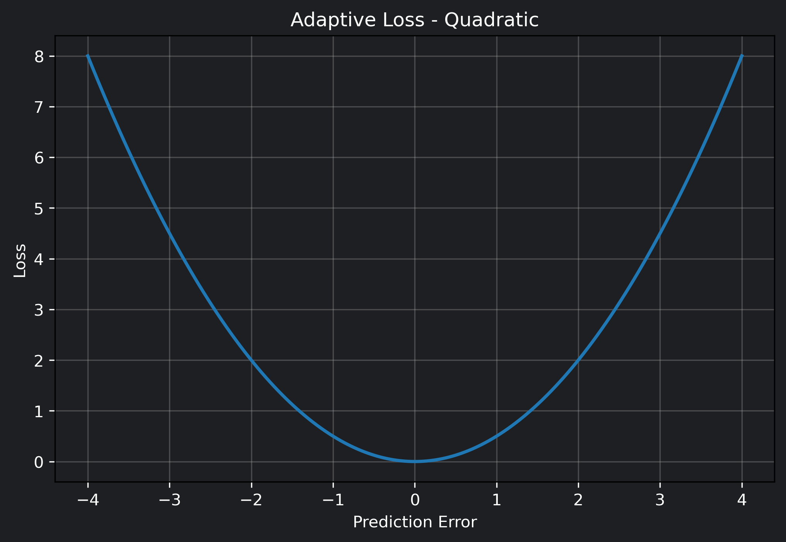
</p>


**Final Results (Epoch 300/300)**

| Metric | Train    | Validation |
|:--------:|:---------:|:------------:|
| Loss   | 0.0695  | 0.1107     |
| R²     | 0.8610  | 0.7782     |

**Best Validation Results**
- Best $R^2$: 0.7889 &nbsp; | &nbsp; Epoch: 240
- Best Loss: 0.1054 &nbsp; | &nbsp; Epoch: 240

**Learning Curves**

<p align="center">
  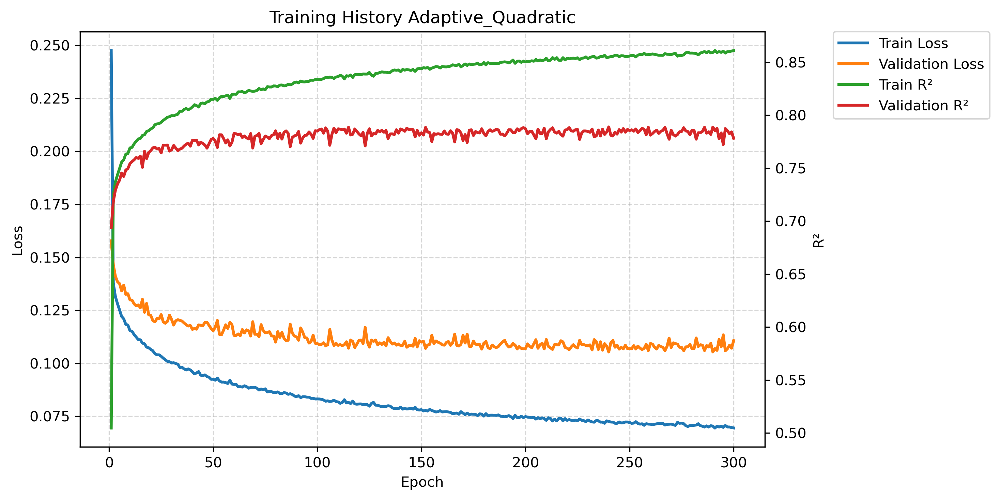
</p>

<p align="center">
  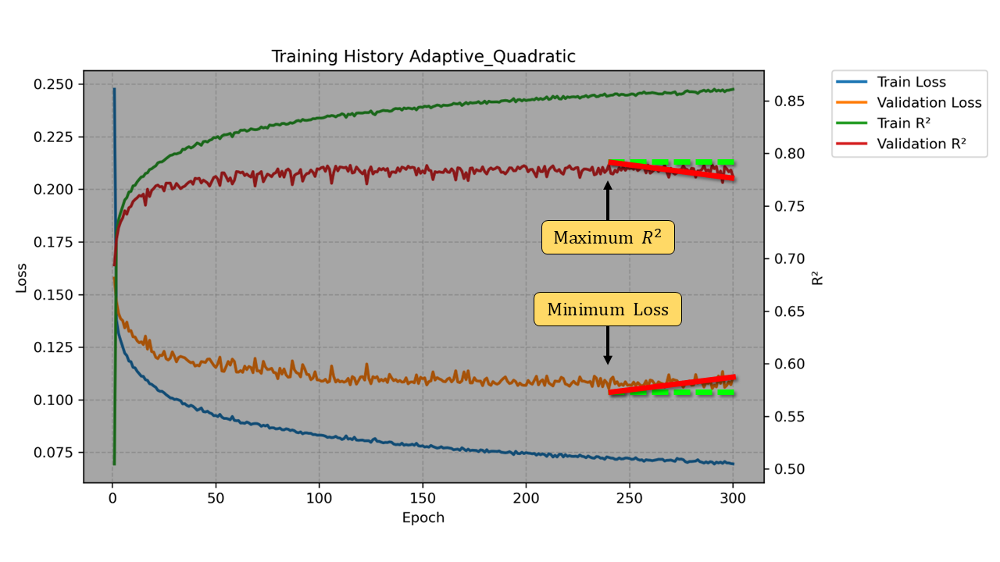
</p>


#### Performance Overview

* **Training Phase:** The model demonstrates steady and effective learning throughout the training process. The training loss decreases consistently to approximately 0.07, while the training $R^2$ score continuously improves, reaching around 0.86.
* **Validation Phase:** The validation metrics closely follow the training progression initially. The validation $R^2$ score reaches its peak value of 0.78 at epoch 240, while the validation loss achieves its minimum value of 0.10 at epoch 240.

#### Overfitting Observation

After reaching these optimal values, the model exhibits a highly controlled and subtle divergence. While the training metrics continue their gradual improvement, the validation loss plateaus with minor fluctuations, and the validation $R^2$ remains remarkably flat and stable. Because the validation performance holds its ground instead of deteriorating, this indicates only a very mild case of overfitting in the later epochs, showing that the adaptive quadratic loss maintains strong generalization.


#### • If $\alpha$ = 0 (Cauchy):

$$
\mathcal{L}_{Cauchy}(x) = \log\left(\frac{1}{2}\left(\frac{x}{c}\right)^2 + 1\right)
$$

When $\alpha = 0$, the adaptive loss reduces to the **Cauchy loss**, which is also known as the Lorentzian loss.
*Barron, 2019, A General and Adaptive Robust Loss Function*. [Paper link](https://arxiv.org/abs/1701.03077)

This formulation provides a strongly robust objective that significantly reduces the influence of outliers by growing logarithmically rather than quadratically.

<p align="center">
  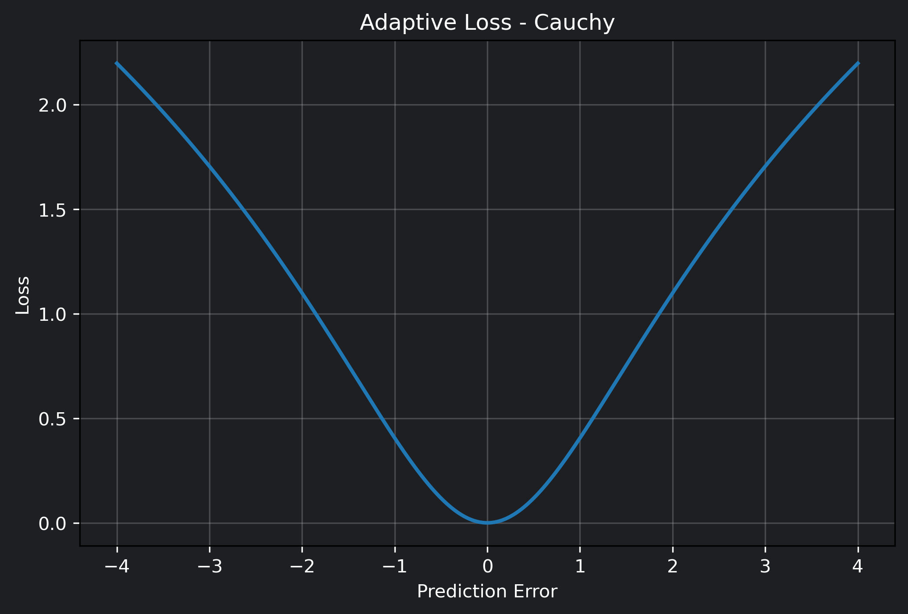
</p>

**Final Results (Epoch 300/300)**

| Metric | Train    | Validation |
|:--------:|:---------:|:------------:|
| Loss   | 0.0696  | 0.1246     |
| R²     | 0.8609  | 0.7646     |

**Best Validation Results**
- Best $R^2$: 0.7925 &nbsp; | &nbsp; Epoch: 103
- Best Loss: 0.1066 &nbsp; | &nbsp; Epoch: 117

**Learning Curves**

<p align="center">
  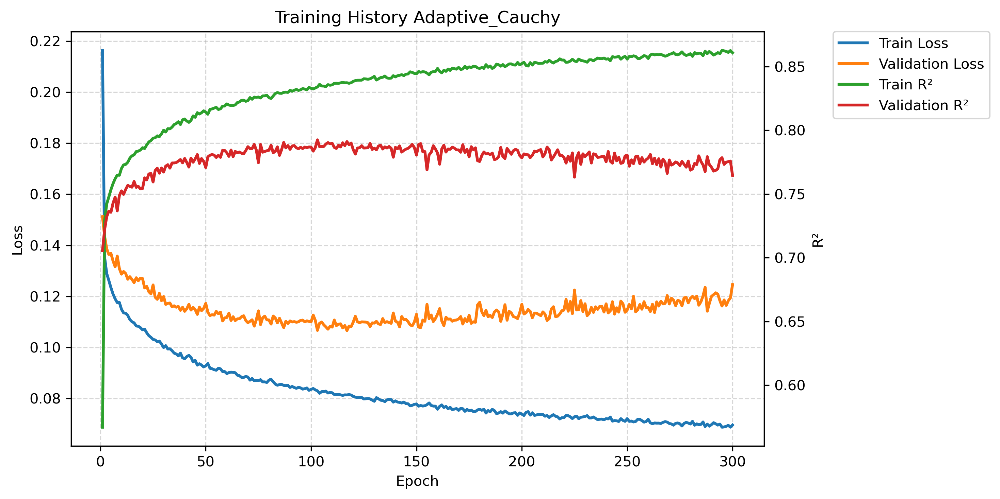
</p>

<p align="center">
  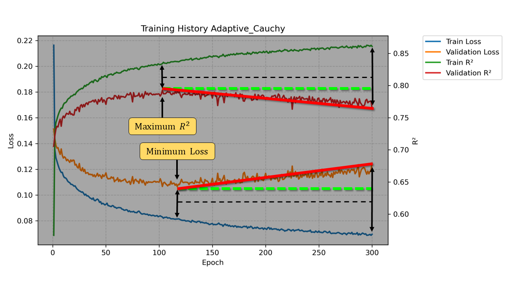
</p>

#### Performance Overview

* **Training Phase:** The model learns effectively from the training dataset. The training loss decreases steadily to roughly 0.07, while the training $R^2$ score improves to approximately 0.86.
* **Validation Phase:** The validation metrics improve alongside the training metrics initially. The validation $R^2$ score reaches its peak value of 0.79 at epoch 103, while the validation loss achieves its minimum value of 0.10 at epoch 117.

#### Overfitting Observation

After reaching these optimal values, a clear divergence is observed between the training and validation curves. While the training metrics continue their steady improvement, the validation loss begins a gradual, slightly noisy upward trend. Concurrently, the validation $R^2$ score starts to slowly degrade. Unlike the stable plateau observed in some other configurations, this noticeable deterioration in validation performance indicates a more pronounced overfitting phase in the later epochs.


#### • If $\alpha \rightarrow -\infty$ (Welsch):

$$
\mathcal{L}_{Welsch}(x) = 1 - \exp\left(-\frac{1}{2}\left(\frac{x}{c}\right)^2\right)
$$

When $\alpha \rightarrow -\infty$, the adaptive loss reduces to the **Welsch loss**.

*Dennis Jr. & Welsch, 1978, Techniques for Nonlinear Least Squares and Robust Regression.* [Paper link](https://www.tandfonline.com/doi/abs/10.1080/03610917808812083)

This loss strongly suppresses the influence of large errors by applying an exponential penalty. Unlike quadratic losses, the growth of the loss saturates for large residuals, making it highly robust to outliers.

<p align="center">
  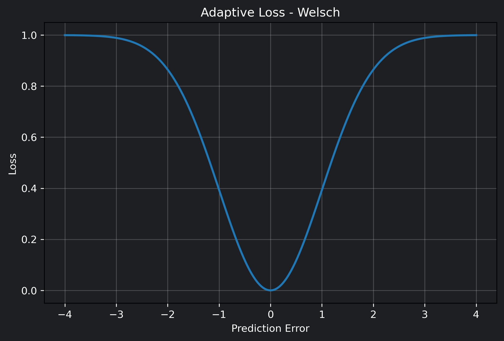
</p>


**Final Results (Epoch 300/300)**

| Metric | Train    | Validation |
|:--------:|:---------:|:------------:|
| Loss   | 0.0548  | 0.0737     |
| R²     | 0.8493  | 0.7917     |

**Best Validation Results**
- Best $R^2$: 0.7971 &nbsp; | &nbsp; Epoch: 169
- Best Loss: 0.0734 &nbsp; | &nbsp; Epoch: 224

**Learning Curves**

<p align="center">
  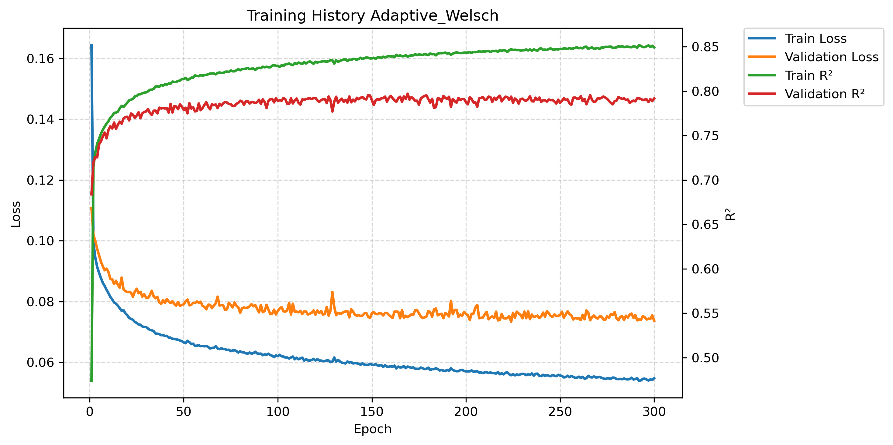
</p>

<p align="center">
  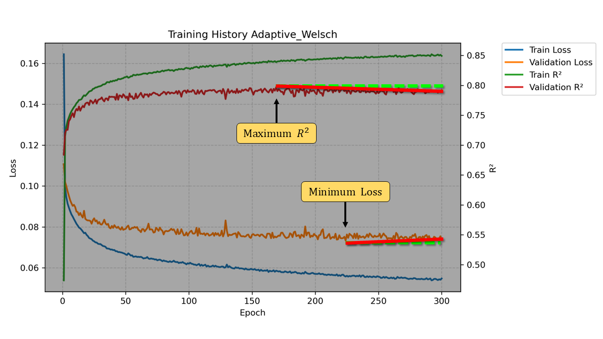
</p>

#### Performance Overview

* **Training Phase:** The model learns effectively from the training dataset. The training loss decreases steadily to roughly 0.055, while the training $R^2$ score improves to approximately 0.85.
* **Validation Phase:** The validation metrics closely follow the training progression initially. The validation $R^2$ score reaches its peak value of 0.79 at epoch 169, and the validation loss achieves its minimum value of 0.07 at epoch 224.

#### Overfitting Observation

After reaching these optimal values, the learning curves demonstrate remarkable stability. While the training metrics continue their gradual improvement, the validation loss plateaus with very minor fluctuations. Concurrently, the validation $R^2$ remains consistently flat without any degradation. Because the validation performance holds its ground exceptionally well over a long period, this indicates only a very mild case of overfitting in the later epochs. The Welsch loss configuration proves to be highly robust, maintaining strong generalization capabilities throughout the extended training process.


#### • If $\alpha$ = 1 (Charbonnier) or $\alpha$ = -2 (Geman-McClure):

$$
\mathcal{L}_{Adaptive}(x;\alpha,c)=
\frac{|\alpha-2|}{\alpha}
\left(
\left(
\frac{\left(\frac{x}{c}\right)^2}{|\alpha-2|}+1
\right)^{\frac{\alpha}{2}}
-1
\right)
$$


#### • $\alpha$ = 1 (Charbonnier):

When α = 1, the adaptive loss reduces to the **Charbonnier loss**.
*Charbonnier et al., 1994, Two-parameter robust estimator for image restoration*. [Paper link](https://ieeexplore.ieee.org/document/413553).

This loss is a smooth approximation of the L1 loss. It grows linearly for large errors, which makes it more robust to outliers compared to the standard quadratic loss, while still being differentiable at zero for stable optimization.

<p align="center">
  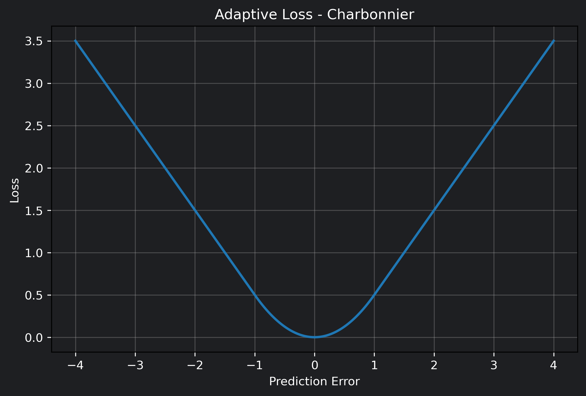
</p>

**Final Results (Epoch 300/300)**

| Metric | Train    | Validation |
|:--------:|:---------:|:------------:|
| Loss   | 0.0578  | 0.0892     |
| R²     | 0.8631  | 0.7857     |

**Best Validation Results**
- Best $R^2$: 0.7923 &nbsp; | &nbsp; Epoch: 121
- Best Loss: 0.0857 &nbsp; | &nbsp; Epoch: 121

**Learning Curves**

<p align="center">
  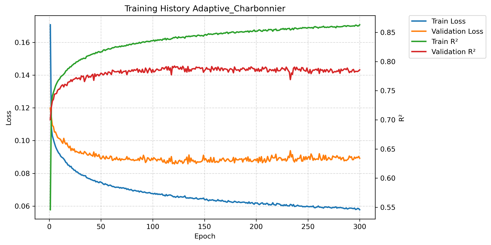
</p>

<p align="center">
  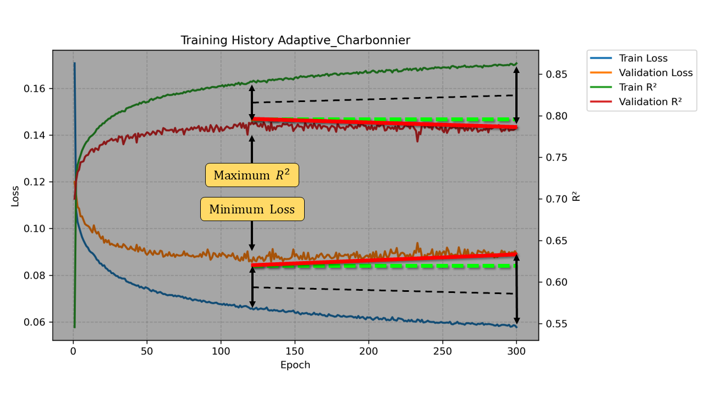
</p>

#### Performance Overview

* **Training Phase:** The model learns effectively from the training dataset. The training loss decreases steadily to roughly 0.06, while the training $R^2$ score improves to approximately 0.86.
* **Validation Phase:** The validation metrics improve alongside the training metrics initially. The validation $R^2$ score reaches its peak value of 0.79 at epoch 121, and the validation loss achieves its minimum value of 0.08 at epoch 121.

#### Overfitting Observation

After reaching these optimal values, the learning curves demonstrate a high level of stability. While the training metrics continue their gradual improvement, the validation loss plateaus with only minor fluctuations, and the validation $R^2$ remains consistently flat without any noticeable degradation. Because the validation performance holds its ground instead of deteriorating, this indicates only a very mild case of overfitting in the later epochs. The Charbonnier loss configuration proves to be robust, maintaining strong generalization capabilities throughout the remainder of the training process.


#### • $\alpha$ = -2 (Geman-McClure):

When α = -2, the adaptive loss reduces to the **Geman-McClure loss**.
*German & McClure, 1987, Robust regression using a bounded influence function*. [Paper link](https://www.dam.brown.edu/people/geman/Homepage/Image%20processing,%20image%20analysis,%20Markov%20random%20fields,%20and%20MCMC/1985GemanMcClureASA.pdf).

This loss is robust to outliers: it grows sub-quadratically for large errors, limiting the influence of extreme deviations. For small errors, it behaves similarly to the L2 loss, ensuring smooth gradients and stable optimization.

<p align="center">
  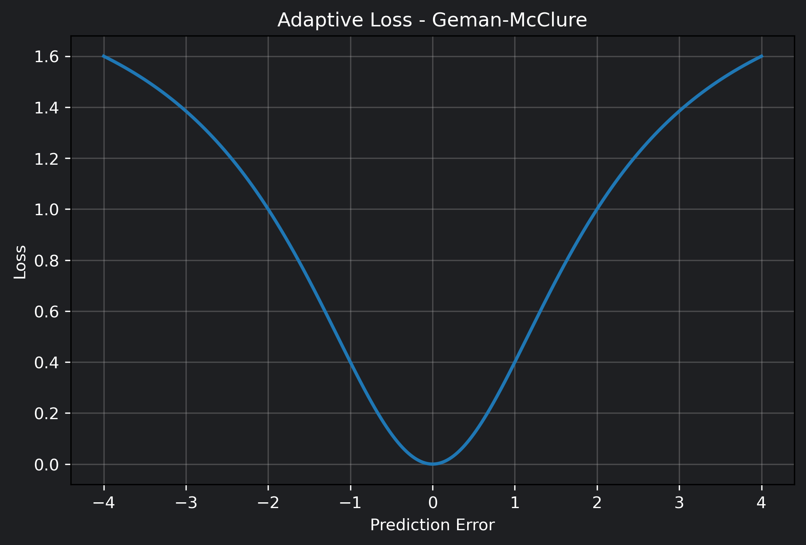
</p>

**Final Results (Epoch 300/300)**

| Metric | Train    | Validation |
|:--------:|:---------:|:------------:|
| Loss   | 0.0556  | 0.0811     |
| R²     | 0.8572  | 0.7798     |

**Best Validation Results**
- Best $R^2$: 0.7961 &nbsp; | &nbsp; Epoch: 117
- Best Loss: 0.0770 &nbsp; | &nbsp; Epoch: 165

**Learning Curves**

<p align="center">
  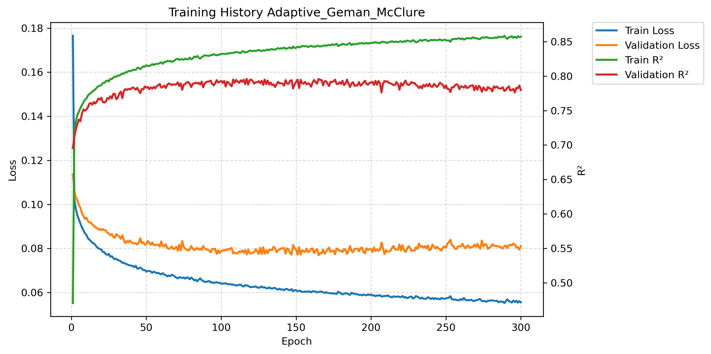
</p>

<p align="center">
  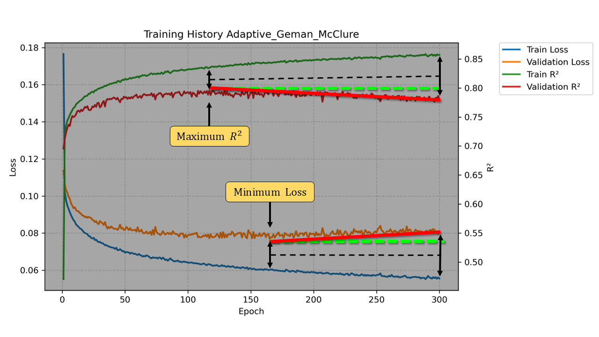
</p>

#### Performance Overview

* **Training Phase:** The model learns effectively from the training dataset. The training loss decreases steadily to roughly 0.06, while the training $R^2$ score improves to approximately 0.86.
* **Validation Phase:** The validation metrics closely follow the training progression initially. The validation $R^2$ score reaches its peak value of 0.79 at epoch 117, and the validation loss achieves its minimum value of 0.07 at epoch 165.

#### Overfitting Observation

After reaching these optimal values, the learning curves display excellent stability. While the training metrics continue their gradual and steady improvement, the validation loss plateaus with minor fluctuations, and the validation $R^2$ remains consistently flat without any significant degradation. Because the validation performance holds its ground remarkably well across later epochs, this behavior indicates only a very mild case of overfitting. The Geman-McClure configuration demonstrates strong robustness, maintaining reliable generalization capabilities throughout the extended training process.

---

### Comparison and Analysis

In this section, I compare the performance of different regression loss functions using the **R² score**. 

The R² score measures how well the model explains the variance of the target variable, giving us a clear metric to evaluate and rank different loss functions.

I trained the same model with multiple loss functions and recorded their R² scores on the validation set. The table below shows a descending ranking of the loss functions based on their performance:

| Rank | Loss Function       | The Best R² Score |
|:------:|:------------------:|:----------:|
| 1    | MAE                      | 0.7987     |
| 2    | Adaptive - Welsch        | 0.7971     |
| 3    | Adaptive - Geman-McClure | 0.7961     |
| 4    | Huber                    | 0.7941     |
| 5    | Adaptive - Cauchy        | 0.7925     |
| 6    | Adaptive - Charbonnier   | 0.7923     |
| 7    | Log-Cosh                 | 0.7898     |
| 8    | Adaptive - Quadratic     | 0.7889     |
| 9    | MSE                      | 0.7872     |


The highest R² score was achieved by the MAE loss function (0.7987), while the lowest R² score was obtained by the MSE loss function (0.7872). The difference between the best and worst results is only 0.0115, indicating that the choice of loss function is not the dominant factor affecting model performance in this project. Instead, data preparation and feature engineering appear to have a greater impact on the final results.

The California Housing dataset is not perfectly normally distributed. Although preprocessing techniques were applied to reduce skewness and mitigate outliers, some distributional irregularities still remain. In addition, the target variable contains a well-known capped value at 500001, which introduces further distortion into the data distribution.

Under these conditions, loss functions such as MSE and Quadratic Loss are highly sensitive to large prediction errors because they penalize errors quadratically. As a result, the model tends to focus excessively on a small number of samples with large residuals, such as very expensive houses or properties located in special districts. This may reduce the model's overall ability to generalize across the entire dataset.

$$
\mathcal{L}_{MSE} = \frac{1}{N} \sum_{i=1}^{N} (y_i - \hat{y}_i)^2
$$

<p align="center">
  
</p>

In contrast, robust loss functions such as MAE and Welsch reduce the influence of extreme samples by limiting the impact of large residuals. Consequently, they achieve slightly better predictive performance on this dataset.

$$
\mathcal{L}_{MAE} = \frac{1}{N} \sum_{i=1}^{N} \left| y_i - \hat{y}_i \right|
$$

<p align="center">
  
</p>

The results also reveal an interesting trend among the Adaptive Loss variants. As the parameter α moves toward more robust loss formulations, the R² score generally improves. This observation suggests that robust loss functions provide better stability and generalization when the dataset contains residual outliers, skewed distributions, or other non-ideal characteristics.

<p align="center">
  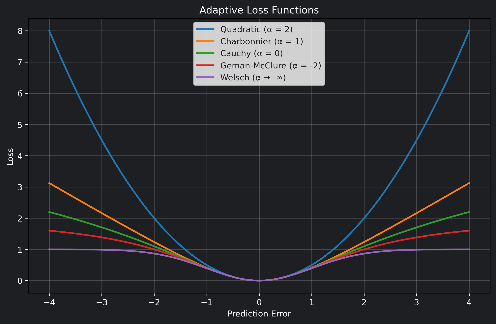
</p>

Overall, the experimental results indicate that robust loss functions consistently outperform traditional quadratic losses on the California Housing dataset, although the performance gap remains relatively small.


## Explore Optimizers

In this section, different optimizers are implemented to evaluate their impact on model behavior. Finally, the R² score for each optimizer is compared in a summary table.

Given that the MAE loss function demonstrated the best performance in `02_loss_functions.ipynb`, it was adopted as the loss function for the optimizer experiment. The loss function for all models is MAE.

This section includes the following subsections:

1. Adam

2. AdamW

3. SGD

4. SGD with Momentum

5. SGD with Nesterov

6. Comparison and Analysis


### 1. Adam

Adam was introduced by **Diederik P. Kingma** and **Jimmy Lei Ba** in 2015 at ICLR. [Paper link](https://arxiv.org/pdf/1412.6980).

The Adam optimizer combines the ideas of Momentum and RMSprop by maintaining exponentially decaying averages of both gradients and squared gradients.

$$
m_t = \beta_1 m_{t-1} + (1 - \beta_1) g_t
$$

$$
v_t = \beta_2 v_{t-1} + (1 - \beta_2) g_t^2
$$

$$
\hat{m}_t = \frac{m_t}{1 - \beta_1^t}, \quad \hat{v}_t = \frac{v_t}{1 - \beta_2^t}
$$

$$
\theta_t = \theta_{t-1} - \alpha \frac{\hat{m}_t}{\sqrt{\hat{v}_t} + \epsilon}
$$

**Final Results (Epoch 300/300)**

| Metric | Train    | Validation |
|:--------:|:---------:|:------------:|
| Loss   | 0.0615  | 0.0916     |
| R²     | 0.8586  | 0.7830     |

**Best Validation Results**
- Best $R^2$: 0.7900 &nbsp; | &nbsp; Epoch: 152
- Best Loss: 0.3008 &nbsp; | &nbsp; Epoch: 137

**Learning Curves**

<p align="center">
  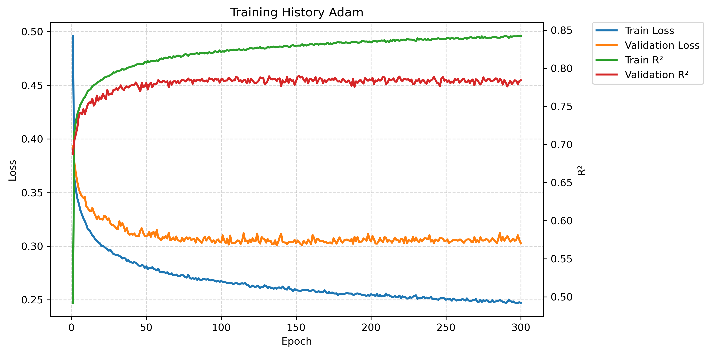
</p>

<p align="center">
  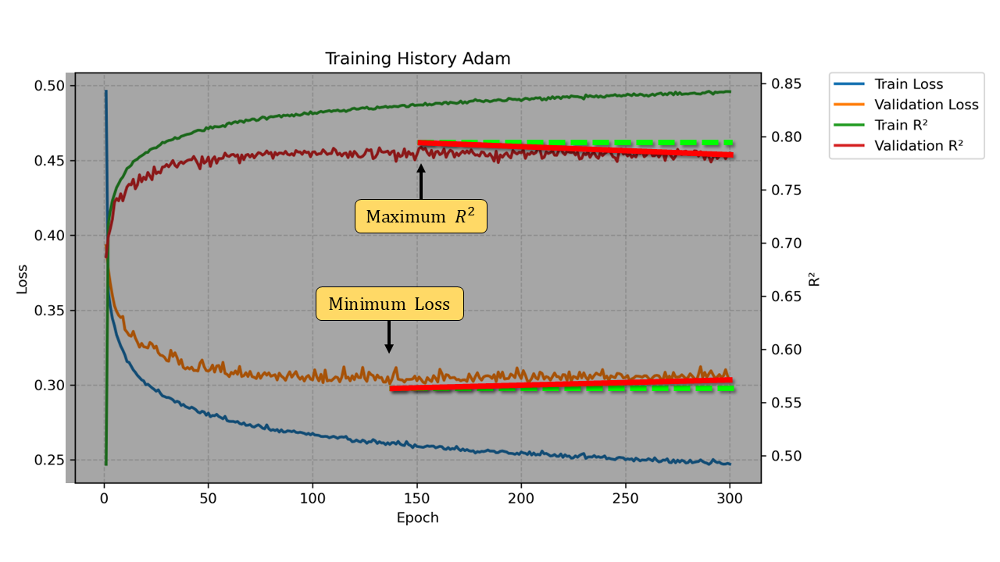
</p>

#### Performance Overview

* **Training Phase:** The model learns effectively from the training dataset. The training loss decreases steadily to roughly 0.24, while the training $R^2$ score improves to approximately 0.85.
* **Validation Phase:** The validation metrics improve alongside the training metrics initially. The validation $R^2$ score reaches its peak value of 0.79 at epoch 152, and the validation loss achieves its minimum value of 0.30 at epoch 137.

#### Overfitting Observation

After reaching these optimal values, a subtle divergence appears between the training and validation curves. The model continues to extract patterns from the training data, as demonstrated by the steady improvement in training metrics. However, the validation loss plateaus with minor fluctuations, and the validation $R^2$ remains highly stable without any significant degradation. Because the validation performance holds its ground instead of deteriorating, this indicates only a very mild case of overfitting in the later epochs. The Adam optimizer combined with the MAE loss function demonstrates stable convergence and maintains reliable generalization capabilities throughout the extended training process.

---

### 2. AdamW

AdamW was introduced by **Ilya Loshchilov** and **Frank Hutter** in 2019. It addresses a key issue in Adam regarding L2 regularization by decoupling weight decay from the gradient-based parameter update. This leads to better generalization and more effective regularization. [Paper link](https://arxiv.org/pdf/1711.05101).

The AdamW optimizer maintains exponentially decaying averages of both gradients and squared gradients, similar to Adam, but applies weight decay as a separate step.

$$
m_t = \beta_1 m_{t-1} + (1 - \beta_1) g_t
$$

$$
v_t = \beta_2 v_{t-1} + (1 - \beta_2) g_t^2
$$

$$
\hat{m}_t = \frac{m_t}{1 - \beta_1^t}, \quad \hat{v}_t = \frac{v_t}{1 - \beta_2^t}
$$

$$
\theta_t = \theta_{t-1} - \alpha \left( \frac{\hat{m}_t}{\sqrt{\hat{v}_t} + \epsilon} + \lambda \theta_{t-1} \right)
$$

Unlike Adam with L2 regularization, AdamW applies weight decay independently of the adaptive gradient update, resulting in improved optimization performance and better model generalization.

**Final Results (Epoch 300/300)**

| Metric | Train    | Validation |
|:--------:|:---------:|:------------:|
| Loss   | 0.2483  | 0.2930     |
| R²     | 0.8409  | 0.7951     |

**Best Validation Results**
- Best $R^2$: 0.8027 &nbsp; | &nbsp; Epoch: 257
- Best Loss: 0.2903 &nbsp; | &nbsp; Epoch: 257

**Learning Curves**

<p align="center">
  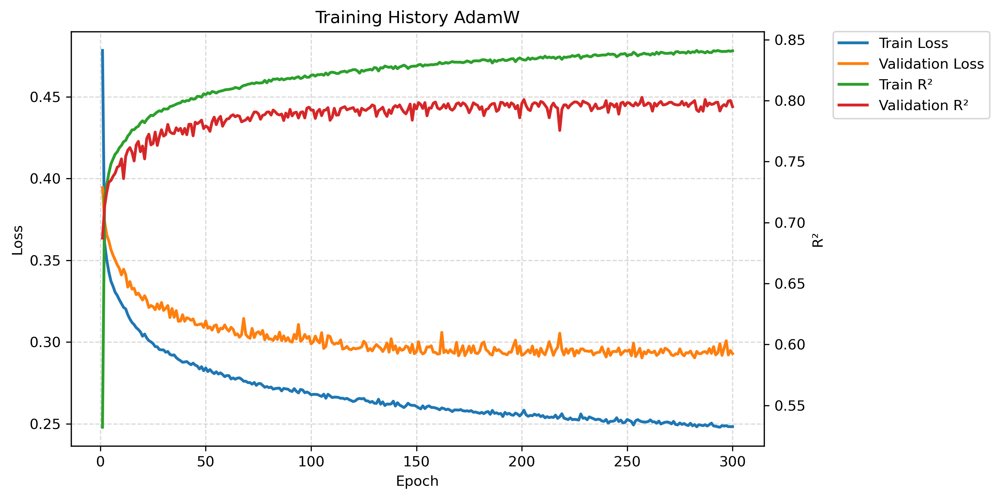
</p>

<p align="center">
  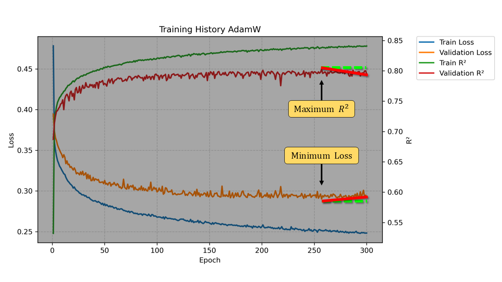
</p>

#### Performance Overview

* **Training Phase:** The model learns effectively from the training dataset. The training loss decreases steadily to roughly 0.25, while the training $R^2$ score improves to approximately 0.84.
* **Validation Phase:** The validation metrics closely track the training progression well into the later stages of training. The validation $R^2$ score reaches an impressive peak value of 0.80 at epoch 257, and the validation loss achieves its minimum value of 0.29 at the same epoch.

#### Overfitting Observation

The learning curves demonstrate remarkable stability and late-stage convergence. Compared to the standard Adam optimizer, AdamW shows a distinct improvement in overall generalization. By properly decoupling weight decay from the gradient updates, AdamW more effectively regularizes the network weights. This explicit regularization is highly beneficial for the California Housing dataset, which contains complex, highly correlated features such as geographical coordinates and localized income distributions. The decoupled weight decay prevents the neural network from memorizing specific local noise or over-relying on individual features. 

Consequently, the validation loss and $R^2$ score do not deteriorate but rather maintain a highly stable plateau even after hundreds of epochs. This behavior confirms that AdamW successfully mitigates overfitting, leading to superior and more robust performance on this specific regression task.

---

### 3. SGD (Stochastic Gradient Descent)

$$
\theta_{t+1}
=
\theta_t
-
\eta
\nabla_{\theta}
\mathcal{L}_i(\theta_t)
$$

#### Effect of Learning Rate on SGD

Unlike Adam, SGD uses a fixed learning rate for all parameters and does not automatically adapt the update size during training. As a result, the choice of learning rate has a significant impact on the optimization process.

<p align="center">
  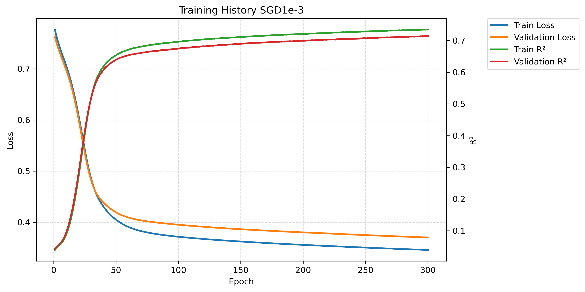
</p>

With a learning rate of **0.001**, the updates are very small, causing the model to learn slowly. The training and validation curves appear smooth with almost no fluctuations because the optimizer takes only tiny steps at each iteration. However, this conservative behavior may lead to underfitting, as the model may not reach a sufficiently good solution within the available number of epochs.

<p align="center">
  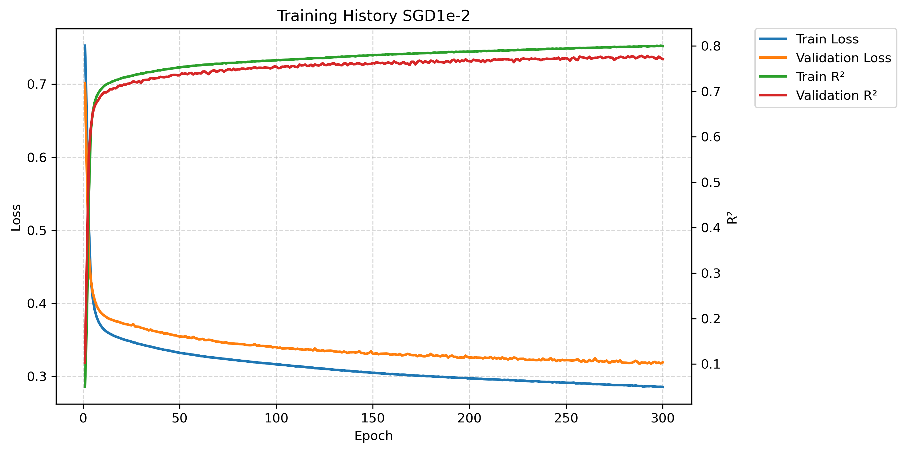
</p>

When the learning rate is increased to **0.01**, the optimizer moves more aggressively through the loss landscape. The convergence becomes faster, and small oscillations begin to appear because the parameter updates are larger.

<p align="center">
  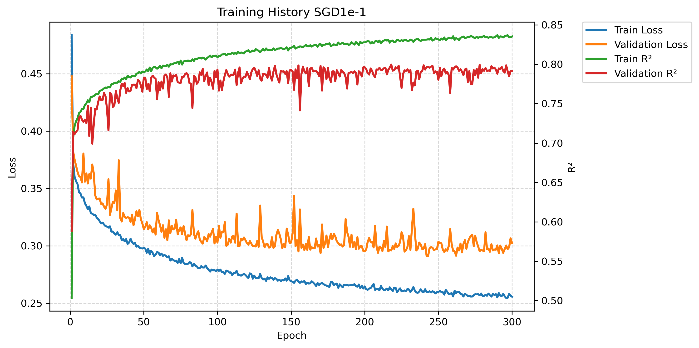
</p>


With a learning rate of **0.1**, the optimizer takes much larger steps. This allows the model to reach a better solution more quickly and resulted in the highest validation performance. The larger updates also introduce noticeable oscillations in the training curves, which is expected because the optimizer frequently overshoots and corrects its trajectory while approaching the optimum.

Overall, the results suggest that a learning rate of **0.1** provides the best balance between convergence speed and predictive performance for this particular dataset and model configuration.

> To ensure a fair comparison among the optimizers, all experiments were conducted using the same learning rate of 0.001. Although SGD achieved better performance with a higher learning rate, the results reported in this section are based on the common configuration used across all optimizers.


**Final Results (Epoch 300/300)**

| Metric | Train    | Validation |
|:--------:|:---------:|:------------:|
| Loss   | 0.3454  | 0.3699     |
| R²     | 0.7349  | 0.7141     |

**Best Validation Results**
- Best $R^2$: 0.7142 &nbsp; | &nbsp; Epoch: 299
- Best Loss: 0.3701 &nbsp; | &nbsp; Epoch: 299

---

### 4. SGD with Momentum

$$
\begin{aligned}
m_t &= \beta m_{t-1} + (1 - \beta) \nabla_{\theta}\mathcal{L}(\theta_{t-1}) \\
\theta_t &= \theta_{t-1} - \eta m_t
\end{aligned}
$$

**Final Results (Epoch 300/300)**

| Metric | Train    | Validation |
|:--------:|:---------:|:------------:|
| Loss   | 0.2827  | 0.3154     |
| R²     | 0.8031  | 0.7767     |

**Best Validation Results**
- Best $R^2$: 0.7781 &nbsp; | &nbsp; Epoch: 298
- Best Loss: 0.3144 &nbsp; | &nbsp; Epoch: 287

**Learning Curves**

<p align="center">
  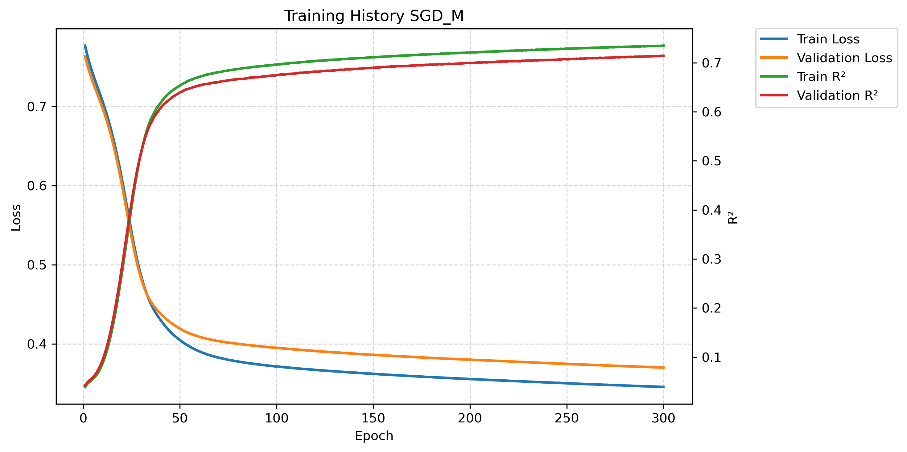
</p>

#### Performance Overview

* **Training Phase:** The model learns in a highly stable and continuous manner. The training loss decreases exceptionally smoothly without local oscillations, while the training $R^2$ score shows a steady upward trajectory throughout the entire training process.
* **Validation Phase:** The validation metrics perfectly mirror the training progression. The validation $R^2$ score reaches its peak value of 0.77 at epoch 298, and the validation loss achieves its minimum value of 0.31 at epoch 287.

#### Underfitting Observation

The learning curves show absolutely no signs of divergence or overfitting. The training and validation curves remain tightly coupled from the first epoch to the last. 

However, this configuration presents a clear case of underfitting due to under-convergence. Because the Stochastic Gradient Descent (SGD) optimizer was configured with a momentum parameter and a carefully tuned, conservative learning rate of 0.001, the weight updates are extremely stable but relatively slow. As evidenced by the peak metrics occurring at the very end of the training cycle (epochs 287 and 298), the model has not yet fully mapped the complex patterns of the California Housing dataset. Both the loss and $R^2$ curves are still improving at epoch 300, indicating that while SGD with momentum provides a very safe optimization path, it requires a significantly higher number of epochs to match the final accuracy achieved by Adam or AdamW.

---

### 5. SGD with Nesterov

$$
\begin{aligned}
\hat{\theta}_t &= \theta_t + \beta m_t \\
m_{t+1} &= \beta m_t - \eta \nabla_{\theta}\mathcal{L}(\hat{\theta}_t) \\
\theta_{t+1} &= \theta_t + m_{t+1}
\end{aligned}
$$

**Final Results (Epoch 300/300)**

| Metric | Train    | Validation |
|:--------:|:---------:|:------------:|
| Loss   | 0.2846  | 0.3155     |
| R²     | 0.8023  | 0.7705     |

**Best Validation Results**
- Best $R^2$: 0.7732 &nbsp; | &nbsp; Epoch: 292
- Best Loss: 0.3147 &nbsp; | &nbsp; Epoch: 296

**Learning Curves**

<p align="center">
  
</p>

#### Performance Overview

* **Training Phase:** The model exhibits highly stable and continuous learning. The training loss decreases smoothly without significant fluctuations, and the training R^2 score maintains a steady upward trajectory.
* **Validation Phase:** The validation metrics closely follow the training progression. The validation R^2 score reaches its peak value of 0.77 at epoch 292, and the validation loss achieves its minimum value of 0.31 at epoch 296.

#### Underfitting Observation

Similar to the standard momentum approach, the addition of Nesterov momentum entirely prevents the divergence issues seen in basic SGD. The learning curves show no signs of overfitting, as the training and validation lines remain tightly coupled throughout the 300 epochs.

However, the model still exhibits underfitting due to under-convergence. While Nesterov momentum modifies the update rule by looking ahead of the current parameter state, the conservative learning rate still yields a very slow optimization path. The peak metrics occur near the very end of the training cycle, and both curves are still noticeably improving at epoch 300. This confirms that the model has not yet reached its full predictive capacity on the California Housing dataset and would require a significantly extended training duration to match the final accuracy of adaptive optimizers.

### 6. RMSprop

$$
\begin{aligned}
s_t &= \rho s_{t-1} + (1-\rho)\left(\nabla_{\theta}\mathcal{L}(\theta_t)\right)^2 \\
\theta_{t+1} &= \theta_t - \frac{\eta \nabla_{\theta}\mathcal{L}(\theta_t)}{\sqrt{s_t}+\epsilon}
\end{aligned}
$$

**Final Results (Epoch 300/300)**

| Metric | Train    | Validation |
|:--------:|:---------:|:------------:|
| Loss   | 0.2467  | 0.3000     |
| R²     | 0.8447  | 0.7847     |

**Best Validation Results**
- Best $R^2$: 0.7950 &nbsp; | &nbsp; Epoch: 119
- Best Loss: 0.2923 &nbsp; | &nbsp; Epoch: 222

**Learning Curves**

<p align="center">
  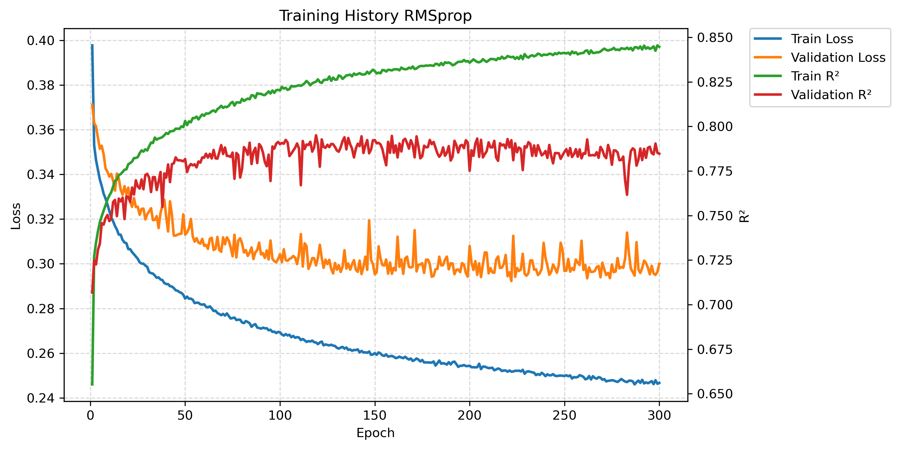
</p>

<p align="center">
  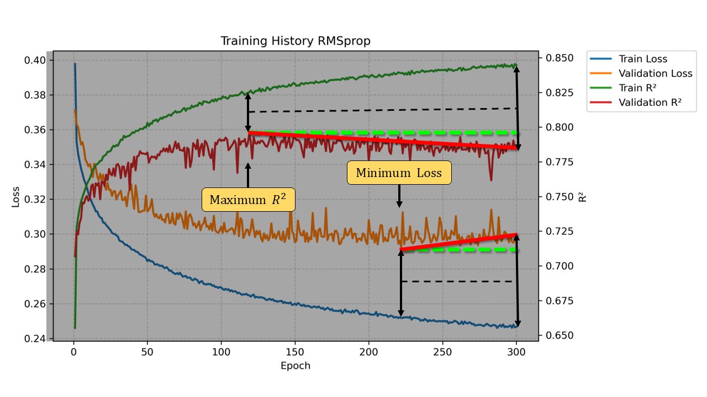
</p>

#### Performance Overview

* **Training Phase:** The model successfully extracts complex patterns from the training dataset. The training loss decreases consistently to approximately 0.24, and the training $R^2$ score climbs steadily to roughly 0.85.
* **Validation Phase:** The validation metrics show rapid initial improvement alongside the training metrics. The validation R² score hits its peak at epoch 119 with a value of 0.79, while the validation loss reaches its absolute minimum of 0.29 at epoch 222.

#### Overfitting Observation

Similar to the standard Adam optimizer, a clear performance gap emerges between the training and validation curves during the later epochs. This divergence confirms the presence of overfitting, as the model continues to optimize on the training data while the overall validation trend stops improving.

The most prominent characteristic of this RMSprop training session is the pronounced volatility in the validation curves. While the training metrics remain perfectly smooth, the validation loss and validation $R^2$ exhibit significant and continuous fluctuations once they reach their optimal plateau. Because RMSprop strictly adapts the learning rate by dividing the gradient by a moving average of its recent magnitude, it can lead to erratic parameter updates near the local minima. On a complex dataset like California Housing, this aggressive adaptation causes the model to constantly oscillate around the optimal weights. Consequently, while RMSprop achieves a highly competitive peak accuracy, it lacks the late stage stability observed in optimizers like AdamW.


### Comparison and Anlysis

In this section, I compare the performance of different optimizers using the **R² score**. 

| Rank | Loss Function       | The Best R² Score |
|:------:|:------------------:|:----------:|
| 1    | AdamW                     | 0.7951     |
| 2    | Adam                      | 0.7900     |
| 3    | RMSprop                   | 0.7847     |
| 4    | SGD with Momentum         | 0.7767     |
| 5    | SGD with Nesterov         | 0.7705     |
| 6    | SGD                       | 0.7141     |

The results indicate that AdamW achieved the highest validation performance with an $R^2$ score of 0.7951, closely followed by Adam with 0.7900. The difference between these two optimizers is relatively small (0.0051), suggesting that both methods perform similarly on the California Housing dataset. RMSprop also produced competitive results with an $R^2$ score of 0.7847, remaining reasonably close to the two Adam-based optimizers.

On the other hand, SGD-based methods showed lower performance. SGD with Momentum (0.7767) and SGD with Nesterov (0.7705) improved noticeably over vanilla SGD (0.7141), demonstrating the benefit of incorporating momentum into the optimization process. The gap between vanilla SGD and the best-performing optimizer (AdamW) is approximately 0.081, which is substantial compared to the differences observed among the adaptive optimizers.

It is important to note that all experiments in this section were conducted using the same learning rate of 0.001 to ensure a fair comparison among the optimizers. While this setting is commonly used for adaptive optimizers such as Adam, AdamW, and RMSprop, it is often suboptimal for SGD-based methods. In preliminary experiments, SGD achieved considerably better performance when a larger learning rate was used. Therefore, the results reported here should be interpreted as a comparison under a common training configuration rather than the best achievable performance of each optimizer.

In the previous notebook, the best result reached an $R^2$ score of 0.7987 using MAE loss with Adam. The difference between that score and the best optimizer result obtained here (0.7951) is only 0.0036, which is very small. Such a difference can easily arise from random weight initialization, stochastic mini-batch sampling, or other sources of training variability. Consequently, there is no contradiction between the two experiments. Overall, the findings suggest that adaptive optimizers consistently provide strong performance on this dataset, while the choice of loss function and data preprocessing may have a comparable or even greater impact on the final predictive accuracy.

---

## Evaluation

In this section, the best model (`AdamW_best_model.pth`), trained with the MAE loss function and the AdamW optimizer, is used to make predictions on the test set and evaluate its final performance.

| $R^2$ | Loss       |
|:------:|:---------:|
| 0.8057    | 0.2897       |

The model achieves a strong generalization performance with an R² of 0.8057 on the test set, indicating that it effectively captures the underlying patterns of the California Housing dataset with stable and low prediction error.
