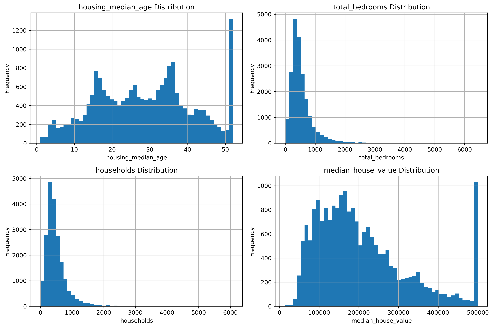
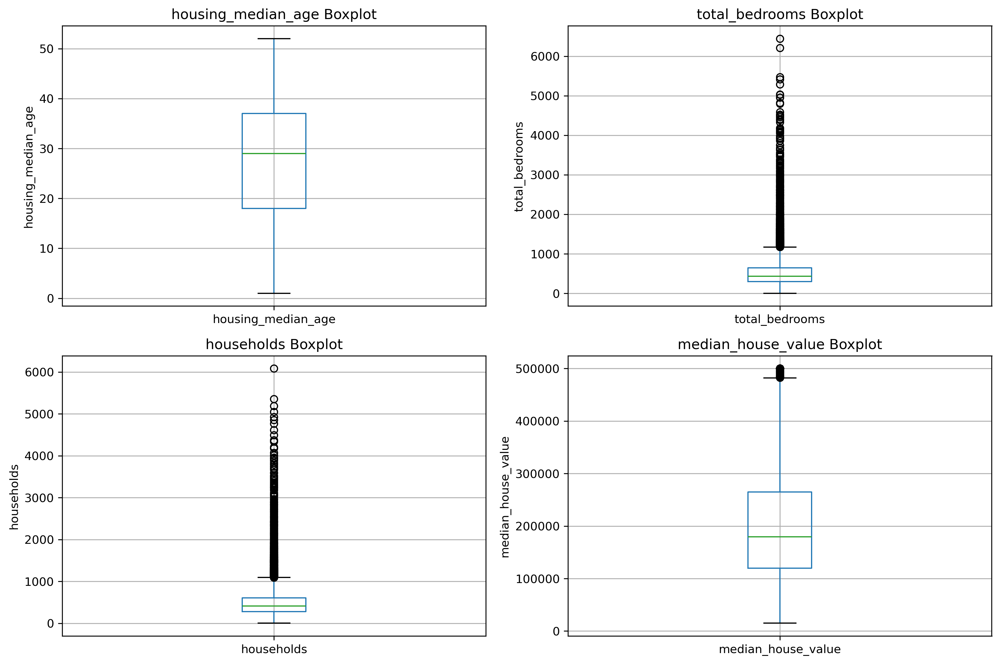

# A Comprehensive Analysis on California Housing Dataset 

## Overview
This project presents an end-to-end experimental analysis of the California Housing dataset. The primary objective is to perform an exhaustive exploratory data analysis (EDA) to understand the underlying patterns and statistical properties of the data. Following the preprocessing stage, the project focuses on designing and training various multilayer perceptron (MLP) architectures, systematically evaluating their performance using different loss functions and optimization algorithms to determine the most effective configuration for predictive modeling.

## Applications

...

## Dataset

The dataset used in this project is the California Housing dataset, which contains information about housing blocks in California based on the 1990 census.
It includes multiple geographic and housing features that can help predict median house values.

### Dataset Information
- **Number of instances:** 20,640
- **Number of features:** 10
- **Target variable:** `median_house_value`
- **Task type:** Regression

### Features

| Feature | Description |
|----------|-------------|
| `longitude` | Geographic longitude of the district |
| `latitude` | Geographic latitude of the district |
| `housing_median_age` | Median age of houses in the district |
| `total_rooms` | Total number of rooms in the district |
| `total_bedrooms` | Total number of bedrooms in the district |
| `population` | Total population living in the district |
| `households` | Total number of households in the district |
| `median_income` | Median household income in the district |
| `ocean_proximity` | Proximity of the district to the ocean |
| `median_house_value` | Median house value in the district (target variable) |

### Target Variable

| Target | Description |
|----------|-------------|
| `median_house_value` | Median house value in USD for a given district |

## Project Structure

...

## File Descriptions

...

## Data Prepartion and Analysis

### Geographic Visualization
Visualize California housing locations using latitude and longitude.

  

Two different color encodings are used:
- Median House Value (target variable)
- Median Income (important feature)

#### 1. Colored by House Price

This plot shows how housing prices vary across California geographically.

  

#### 2. Colored by Income

This plot shows the relationship between income distribution and location.

  

> Key Observations:
> - Coastal areas tend to have higher house prices
> - Higher income regions align with expensive housing areas
> - Location is a critical predictive feature

---

### Missing Values

- Total missing values: 207 (all in the `total_bedrooms` column)

---

### Initial Statistical Insights

1. Population
    - mean = 1425
    - max = 35682

2. Total Rooms
    - mean = 2635
    - max = 39320

3. Median Income
    - mean = 3.87
    - max = 15

> #### Key Findings:
> Large gaps between mean and maximum values in several features suggest the presence of skewed distributions and potential extreme values.

---

### Distribution and Outlier Validation

In this section, I validate initial assumptions using visual and statistical methods such as histograms, boxplots, and IQR analysis.

### 1. Population

#### 1.1. Histogram

The histogram illustrates the distribution of the `population` feature across different districts within the California Housing dataset.

  

> #### Key Observations:
> * **Right-Skewed Distribution:** The feature exhibits a significant positive skewness. The vast majority of districts cluster at the lower end of the scale, specifically between 0 and 5,000 residents, where the peak frequency occurs.
> * **Presence of Outliers:** A long tail extends far to the right, reaching values up to 35,000. These highly populated districts are sparse but represent significant outliers compared to the typical data distribution.

> #### Modeling Implications:
> Highly skewed features can adversely affect the optimization process of deep learning architectures by distorting loss functions and causing unstable gradient updates during backpropagation.

#### 1.2. Boxplot

The boxplot for the `population` feature corroborates the findings from the histogram, providing a clear statistical visualization of the data's dispersion and extreme values.

  

> #### Key Observations:
> * **Asymmetrical Distribution:** The interquartile range (the central box containing the middle 50 percent of the data) is highly compressed towards the lower end of the scale. The median line is positioned closer to the first quartile, confirming the strong positive skewness.
>
> * **Extreme Outlier Concentration:** The most prominent feature of this boxplot is the dense, continuous column of outlier points extending far beyond the upper whisker, reaching up to approximately 35,000 residents. This visually quantifies the immense magnitude and high frequency of outliers in densely populated districts.

> #### Modeling Implications:
> In the context of deep learning pipelines, these extreme outliers are highly problematic. They can disproportionately influence the loss function and lead to vanishing or exploding gradients during backpropagation.

#### 1.3. IQR

To systematically identify and mitigate the impact of extreme values, I employed the Interquartile Range (IQR) method. This approach provides a robust framework for detecting outliers that lie significantly beyond the normal distribution of the structural features.

#### Methodology:
* **IQR Calculation:** Defined as the difference between the 75th percentile (Q3) and the 25th percentile (Q1).
* **Boundaries:** We established the upper threshold for "normal" data using the standard Tukey's fence formula: `Upper Bound = Q3 + (1.5 * IQR)`.
* **Outlier Detection:** Data points exceeding this threshold are flagged as extreme outliers, which are indicative of unusually high-density residential districts.

> #### Key Findings:
> * **Statistical Threshold:** With a calculated Q1 of 787 and Q3 of 1725, the IQR stands at 938. Consequently, any district with a population exceeding **3,132** is classified as a statistical outlier.
>
> * **Impact Analysis:** A significant portion of the dataset falls beyond this upper bound. These extreme values are not necessarily errors, but rather represent densely populated districts that require special handling to prevent them from disproportionately biasing the neural network's gradient updates during training.

### 2. Total Rooms

#### 2.1. Histogram

The histogram illustrates the distribution of the `total_rooms` feature across different districts within the California Housing dataset. 

  

> #### Key Observations:
> * **Right-Skewed Distribution:** The feature exhibits a significant positive skewness. The vast majority of districts cluster at the lower end of the scale, specifically between 1,000 and 4,000 rooms, where the peak frequency occurs near 2,000 rooms.
>
> * **Presence of Outliers:** A long tail extends far to the right, reaching values close to 40,000 rooms. These blocks with an exceptionally high number of total rooms represent extreme outliers compared to the typical data distribution.
>
> * **Correlation with Population:** This distribution strongly mirrors the structural pattern observed in the `population` feature. Districts with larger populations naturally scale up in the total number of rooms.

> #### Modeling Implications:
> Highly skewed features can adversely affect the optimization process of deep learning architectures by distorting loss functions and causing unstable gradient updates during backpropagation.

#### 2.2. Boxplot

The boxplot for the `total_rooms` feature strongly aligns with its corresponding histogram, highlighting a severe positive skew and a massive presence of extreme values.

  

> #### Key Observations:
> * **Compressed Interquartile Range:** The central box, representing the middle 50 percent of the districts, is heavily compressed between approximately 1,500 and 3,000 rooms. The median line sits near the lower quartile, emphasizing the right-skewed nature of the data.
>
> * **Dense Outlier Trail:** Similar to the population data, there is a dense, unbroken vertical sequence of outlier points extending from the upper whisker up to nearly 40,000 rooms. This indicates that a significant number of districts have an exceptionally high room count compared to the standard regional norm.
>
> * **Structural Correlation:** The identical outlier behavior seen here and in the population boxplot reinforces the direct structural dependency between the number of residents and the total number of rooms in a given district.

> #### Modeling Implications:
> Feeding these extreme, unscaled outliers directly into a neural network can cause severe gradient instability during backpropagation.

#### 3. Median Income

#### 3.1. Histogram

The histogram illustrates the distribution of the `median_income` feature across different districts within the California Housing dataset. Note that the x-axis values represent tens of thousands of US Dollars (e.g., a value of 3 indicates $30,000).

  

> #### Key Observations:
> * **Near-Normal Distribution:** Unlike the heavily skewed structural features, the median income displays a more symmetric, bell-shaped curve. The majority of districts have a median income clustering between 2 and 5 (i.e., $20,000 to $50,000), where the peak frequency occurs.
>
> * **Capped Values (Artificial Threshold):** There is a distinct, abnormal spike at the maximum value of 15.0 on the far right. This indicates that the data collection process applied a strict upper bound, capping all higher incomes at this exact threshold.

> #### Modeling Implications:
> While the relatively symmetric distribution of this feature is highly favorable for neural network optimization, the artificial cap at 15.0 introduces a sharp data discontinuity. Deep learning models might struggle to accurately map gradients for these capped districts because the true income variance is lost.

#### 3.2. Boxplot

The boxplot for the `median_income` feature provides a distinct contrast to the highly skewed structural features, while also visually confirming the artificial capping observed in the histogram.

  

> #### Key Observations:
> * **Centralized Interquartile Range:** The central box, representing the middle 50 percent of the data, spans approximately from 2.5 to 4.8. The median line is relatively centered within this box, which reflects a much more symmetric distribution for the majority of the districts.
>
> * **Identifiable Outlier Threshold:** Outliers begin to appear just above the 8.0 mark. While there is a continuous stream of high-income outliers, the distribution is far less extreme than the structural features.
>
> * **Artificial Capping at 15.0:** The most critical anomaly is the dense cluster of outlier points resting exactly at the 15.0 maximum value. This visually proves the hard cap applied during data collection, where all incomes exceeding $150,000 were mapped to this single flat threshold.

> #### Modeling Implications:
> The core distribution of this feature is highly suitable for neural network processing. However, the artificial cap at 15.0 creates a stark boundary that can confuse optimization algorithms.

*To understand the behavior of the data, the histograms of the remaining features **(Housing Median Age, Total Bedrooms, Households, Median House Value)** were also examined.*

  

> **housing_median_age:** Shows an artificial spike at 52 years, indicating the data was capped during collection.

> **total_bedrooms:** Exhibits a strong right skew with a long tail of extreme values.

> **households:** Strongly correlated with the population feature, this demographic variable exhibits a heavy right skew.

> **median_house_value:** Displays a relatively normal distribution but features a massive artificial spike at $500,000. This indicates a strict cap on property values during data collection.

Among the four analyzed features, the boxplot for `housing_median_age` showed no statistical outliers and required no treatment, whereas the boxplots for `total_bedrooms`, `households`, and `median_house_value` all revealed significant outlier issues.

  

